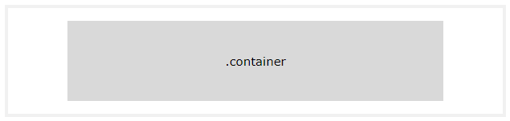
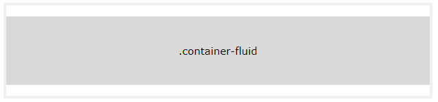
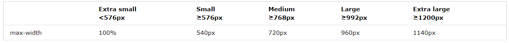
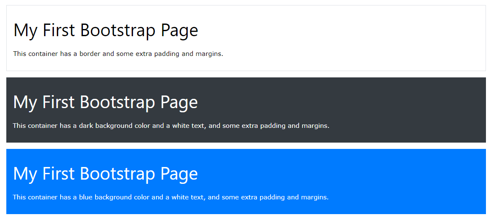
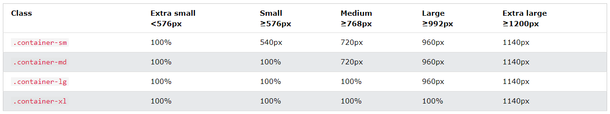
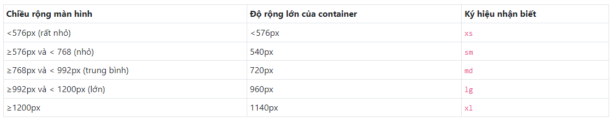

# Bootstrap là gì
- Bootstrap là 1 front-end framework free để phát triển web nhanh và dễ dàng hơn 
- Gồm các mẫu thiết kế dựa trên HTML & css cho typography, forms, buttons, tables, navigation, modals, image carousels and many other
- Giúp dễ dàng tạo ra các thiết kế đáp ứng
- Lý do nên dùng: 
    - Dễ sử dụng
    - Hỗ trợ responsive
    - Tương thích với all trình duyệt hiện đại

# Bootstrap container

## Container
- Yêu cầu 1 phần tử chứa để bao bọc nội dung trang web
- Vùng chứa để đệm nội dung bên trong & có sẵn 2 lớp vùng chứa
    - .container: Lớp cung cấp vùng chứa có chiều rộng cố định đáp ứng
    
    - .container-fluid: Cung cấp vùng chứa có chiều rộng đầy đủ mở rộng toàn bộ chiều rộng của khung nhìn
    
## Fixed Container
- Sử dụng .container để tạo 1 vùng chứa đáp ứng có chiều rộng cố định
- max-width sẽ thay đổi trên các kích thước màn hình khác nhau

## Fluid Container
- Tạo vùng chứa có chiểu rộng đầy đủ. Vùng chứa sẽ luôn kéo dài toàn bọ chiều rộng của màn hình (Luôn là 100%)
## Container Padding
- Mặc định vùng chứa có phần đệm bên trái và phải là 15px k có trên dưới
- Sử dụng .pt-3 để phần đệm trên cùng là 16px
    ```html
    <div class="container pt-3"></div> 
    ```
## Container Border and Color
- Các đường viền và màu cũng thường được sử dụng với các container
    ```html
    <div class="container p-3 my-3 border">Có đường viền và margin & paddding</div>

    <div class="container p-3 my-3 bg-dark text-white">Màu nền đen và text trắng, cùng margin & paddding</div>

    <div class="container p-3 my-3 bg-primary text-white">Màu nền blue và text trắng, cùng margin & paddding</div>
    ```
    
## Responsive Containers
- Sử dụng các lớp .container-sm | md | lg | xl để tạo vùng chứa đáp ứng
- Chiều rộng tối đa của vùng chứa thay đổi trên kích thước màn hình khác nhau
    ```html
    <div class="container-sm">.container-sm</div>
    <div class="container-md">.container-md</div>
    <div class="container-lg">.container-lg</div>
    <div class="container-xl">.container-xl</div>
    ```
    

# Grids
-  Boostrap có 5 lớp: 
    - .col- : Thiết bị nhỏ - chiều rộng nhỏ hơn 576px
    - .col-sm- : Thiết bị nhỏ - Chiều rộng màn hình bằng hoặc lớn hơn 576px
    - .col-md- : Thiết bị trung bình - Chiều rộng màn hình bằng hoặc lớn hơn 768px
    - .col-lg- : Thiết bị lớn - Chiều rộng màn hình bằng hoặc lớn hơn 992px
    - .col-xl- : Thiết bị cực lớn - Chiều rộng màn hình bằng hoặc lớn hơn 1200px
- Cấu trúc cơ bản BTS4 Grid
     ```html
     <!-- Kiểm soát chiều rộng cột và cách xuất hiện trên các thiết bị khác nhau -->
     <div class="row">
        <div class="col-*-*"></div>
        <div class="col-*-*"></div>
    </div>
    <div class="row">
        // * đầu tiên đại diện cho: sm, md, lg, xl 
        //* 2 đại diện cho số cộng tối đa 12 cho mỗi hàng 
        <div class="col-*-*"></div>
        <div class="col-*-*"></div>
        <div class="col-*-*"></div>
    </div>

    <!-- Hoặc để bts tự động xử lý bố cục -->
    <div class="row">
        <div class="col"></div>
        <div class="col"></div>
        <div class="col"></div>
    </div>
    ```

# Xây dựng layout cơ bản với boostrap
- 1 số class: 
    - breakpoint : sm md lg xl
    - .container: Phần tử chứa layout
    - .row: Lớp tạo hàng của lưới
    - .col: Lớp tạo cột của lưới
    - .col-*: * = (1 - 12), lớp tạo cột có độ rộng cụ thể như .col-1, .col-2,... hiệu lực cho all breakpoint
    - .col-{breakpoint}-*: * = (1 - 12) lớp tạo cột có độ rộng cụ thể .col-sm-1, .col-lg-2 hiệu lực với breakpoint cụ thể
    - .col-{breakpoint}-auto .col-auto : Cột có độ rộng điều chỉnh theo nội dung nó chứa
    - .align-items{-breakpoint}-*: Thiết lập thuộc tính của align-items của flex-box
    - .align-content{-breakpoint}-*: Thiết lập thuộc tính của align-content của flex-box
    - .justify-content{-breakpoint}-*: Thiết lập thuộc tính của justify-content của flex-box
    - .align-self{-breakpoint}-*: Thiết lập thuộc tính của align-self của flex-box

## Phần tử chứa để xây dựng bố cục layout - các breakpoint
- SỬ dụng class container để tạo ra 1 vùng chữ nhật mà chiều rộng phụ thuộc vào kích thước màn hình hiển thị


## Grid 
- Sử dụng các lớp về dòng (row), cột (colunm) phối hợp với nhau để tạo ra hệ thống lưới giao diện 
- Lưới layout được tạo ra từ các hàng bằng cách sử dụng class .row

## Chia hàng thành nhiều cột với .col
- Do .col có thiết lập flex-grow: 1 nên muốn chia 1 hàng thành nhiều cột (Bằng số phần tử sử dụng .col) có độ rộng bằng nhau 
    ```html
        <div class="container">
            <div class="row">
                <div class="col bg-danger">
                    Cột 1
                </div>
                <div class="col bg-info">
                    Cột 2
                </div>
                <div class="col bg-warning">
                    Cột 3
                </div>
            </div>
    ```


