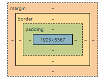

## Id và class
- Id là duy nhất không được trùng
- Class có thể trùng để css cho nhiều thẻ 
## Đặt tên biến
```css
:root {
    --text-color: red;
}
*Gọi biến*
h1 {
    color: var(--text-color)
}
```
## Đơn vị trong css
- Absolute units (Tuyệt đối)
    - px: Với màn phân giải thấp 1px tương ứng với 1 điểm ảnh 
- Relative units(Tương đối)
    - %: Phụ thuộc vào thẻ chứa nó
    - rem: Phụ thuộc vào thẻ html
    - em: Phụ thuộc vào thẻ gần nhất có thuộc tính giống nhau
    - vw (viewport width), vh(viewport height): Gần giống như % nhưng nó không bị phụ thuộc vào thẻ chứa nó
## Css padding, boder, margin
- Padding: Đệm thêm vào làm tổng kích thước giày lên (Không thể tạo ra khoảng cách)
- Border: Cũng làm tăng tổng kích thước của element (Không thể tạo ra khoảng cách)
- Margin: Tạo ra khoảng cách & không làm giày lên (Chỉ là khoảng cách đẩy ra)
## Box-sizing
- border-box: Giữ kích thước ban đàu
## Background-clip
- Xác định danh giới được đổ từ hướng nào 
    - border-box: Đổ từ border vào
    - padding-box: Đổ từ padding vào
    - content-box: Đổ content
    
## Background-position
- Chỉnh được vị trí ảnh nền (top left center bottom)
## Css pseudo-class (Lớp giả)
- :root: Tham chiếu vào phần tử gốc (Thẻ HTML)
- :active: Khi click vào
- :first-child: Phần đầu
- :last-child: Phần cuối
## Css pseudo-elements
- Có thể tạp ra các phần tử mà không cần viết HTML, chỉ cần viết css
    ```css
    .box::before {
        content: ""; // Giúp element giả có thể tồn tại được 
        display: block; //Thêm vào để có tính chất khối giống thẻ div
        width: 50px;
        height: 50px;
        background-color: #fff;
    }
    ```
- ::first-letter: Chữ cái đầu tiên
- ::first-line: Dòng đầu tiên
- ::selection: Bôi chuột
## Css position
- Tạo ra các vị trí hiển thị cho các element
    - Relative (Tương đối) 
        - Không bị phụ thuộc vào đối tượng khác, lấy chính nó làm gốc toạ độ
        - Dùng top right left bottom để căn
        - Đè lên các thuộc tính khác
    - Absolute (Tuyệt đối)
        - Phụ thuộc vào thẻ cha gần nhất có thuộc tính là position để làm gốc toạ độ (Chạy bên trong position cha)
    - Fixed: Giữ nguyên 1 chỗ thường dùng làm menu (Phụ thuộc vào khung trình duyệt)
    - Sticky (Bám dính cũng phụ thuộc vào khung trình duyệt, ít được sử dụng)
## BEM
- Là tiêu chuẩn đặt tên class khi viết CSS
- Viết tắt của Block Element Modifier
    - Block: Khối
    - Element: Thành phần trong khối
    - Modifier: Bổ sung ý nghĩa cho block hoặc element
- Cú pháp
    - .block
    - .block__element

    - .block--modifier
    - .block__element--modifier

- Animation
    ```css 
    @keyframes headerNotifyGrowth {
    from {
        opacity: 0;
        transform: scale(0);
    }
    to {
        opacity: 1;
        transform: scale(1);
    }
    ```
    // Sử dụng:
    ```css
    animation: headerNotifyGrowth ease-in 0.25s;
    ```
    - will-change: Nói cho trình duyệt biết thuộc tính gì sẽ thay đổi (Tối ưu chuyển động hơn)
    ```css
    will-change: opacity,transform
    ```

    

