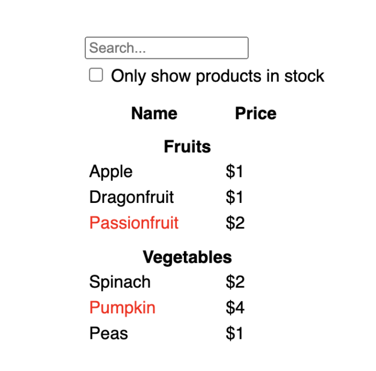
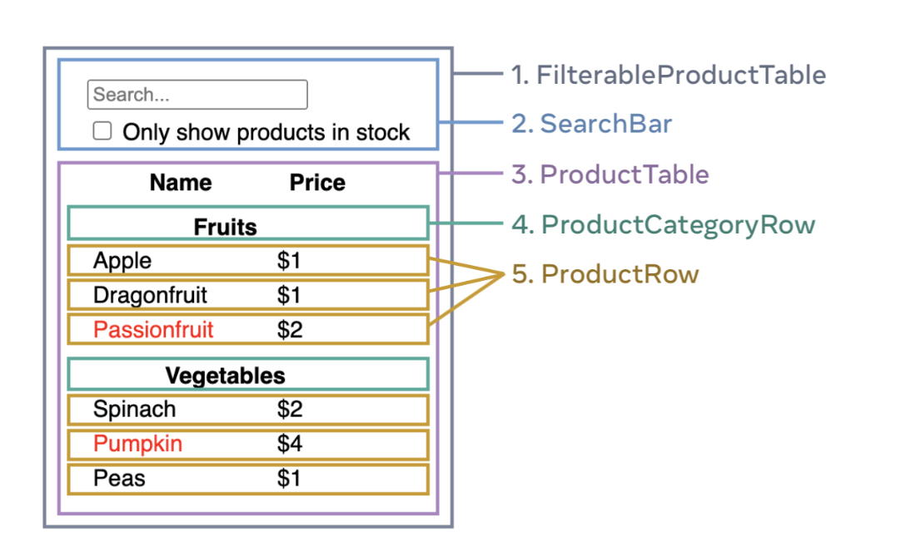

> https://react.dev/learn/thinking-in-react

# Thingking in React
- React có thể thay đổi cách bạn nghĩ về các desgin bạn nhìn vào và các ứng dụng bạn thay đổi. Khi xây dựng ứng dụng bằng React, trước tiên sẽ chia UI thành nhiều phần gọi là component. Sau đó, bạn sẽ mô tả các state trực quan khác nhau cho từng component của mình. Cuối cùng, bạn sẽ connect các component của mình lại với nhau để dữ liệu chảy qua chúng. Trong phần này, sẽ hướng dẫn quy trình xây dựng bảng dữ liệu sản phẩm có thể tìm kiếm bằng React

# Start with the mockup
- Hãy tưởng tượng rằng bạn đã có 1 JSON API và mockup từ designer. JSON API sẽ trông như sau
```js
[
  { category: "Fruits", price: "$1", stocked: true, name: "Apple" },
  { category: "Fruits", price: "$1", stocked: true, name: "Dragonfruit" },
  { category: "Fruits", price: "$2", stocked: false, name: "Passionfruit" },
  { category: "Vegetables", price: "$2", stocked: true, name: "Spinach" },
  { category: "Vegetables", price: "$4", stocked: false, name: "Pumpkin" },
  { category: "Vegetables", price: "$1", stocked: true, name: "Peas" }
]
```
- Mockup sẽ trông như này


- Để triển khai UI trong React, bạn thường sẽ thực hiện theo 5 bước giống nhau

## Step 1: Break the UI into a component hierarchy
- Bắt đầu bằng việc cách vẽ các boxes xung quanh mọi component và subcomponent trong mockup và đặt tên cho chúng. Nếu bạn làm việc với designer, họ có thể đã đặt tên cho các component này trong design tool. Hãy hỏi họ!
- Tuỳ thuộc vào nền tảng của mình, bạn có thể nghĩ đến việc chia nhỏ design thành các phần theo nhiều cách khác nhau:
  - **Programing** - Sử dụng các kỹ thuật tương tự để quyết định xem bạn có thể tạo 1 hàm hoặc 1 object mới không. Một trong những kỹ thuật như vậy là `single responsibility principle`, nghĩa là 1 component chỉ nên làm 1 việc. Nếu nó phát triển, nó sẽ được phân tách thành các component nhỏ hơn
  - **CSS** - hãy cân nhắc mục đích bạn muốn tạo class selectors (Tuy nhiên, các component ít chi tiết hơn 1 chút)
  - **Design** - Hãy cân nhắc cách bạn sắp xếp các design layer
- Nếu JSON của bạn có cấu trúc ok, bạn thường thấy rằng nó tự nhiên ánh xạ tới cấu trúc component của UI. Đó là vì UI của người dùng và mô hình dữ liệu thường có cùng kiến trúc thông tin, tức là có cùng 1 hình dạng. Phân chia UI của bạn thành các component, trong đó, mỗi component khớp với 1 phần của data model của bạn
- Có 5 component trên screen này

1. FilterableProductTable (gray) chứa toàn bộ ứng dụng.
2. SearchBar (blue) Nhận thông tin đầu vào của người dùng
3. ProductTable (lavender) Hiển thị và lọc danh sách theo thông tin người dùng nhập vào
4. ProductCategoryRow (green) Hiển thị title cho mỗi category
5. ProductRow (yellow) Hiển thị 1 row cho mỗi product

- Nếu bạn nhìn vào ProductTable bạn sẽ thấy rằng title header (chứa label "Name" và "Price") không phải là component riêng của nó. Đây là vấn đề sở thích, bạn có thể chọn cách nào cũng được. Trong ví dụ này, nó là 1 phần của ProductTable vì nó xuất hiện trong danh sách của ProductTable. Tuy nhiên, nếu title này trở nên phức tạp (Ví dụ: Nếu bạn thêm tính năng sắp xếp), bạn có thể di chuyển nó vào component ProductTableHeader riêng. 
- Bây giờ, bạn đã xác định được các component trong mockup. Các component xuất hiện bên trong 1 component khác trong mockup sẽ xuất hiện dưới dạng component con trong hệ thống phân cấp
```
- FilterableProductTable
  - SearchBar
  - ProductTable
      - ProductCategoryRow
      - ProductRow
```
## Step 2: Build a static version in React 
- Bây giờ, bạn đã có hệ thống phân cấp các component, đã đến lúc triển khai ứng dụng của bạn. Cách tiếp cận trực tiếp là xây dựng 1 phiên bản hiển thị UI của người dùng mô hình dữ liệu của bạn mà không cần thêm bất kỳ tính tương tác nào... ngay bây giờ! Thường thì việc xây dựng phiên bản tĩnh trước rồi thêm tính tương tác sau sẽ dễ dàng hơn. Xây dựng phiên bản tĩnh đòi hỏi phải gõ nhiều và không cần suy nghĩ, nhưng thêm tính tương tác thì nó đòi hỏi phải suy nghĩ nhiều và không cần gõ nhiều.
- Để xây dựng phiên bản tĩnh của ứng dụng hiển thị mô hình dữ liệu của bạn, bạn sẽ muốn xây dựng các component tái sử dụng thành các component khác và truyền data bằng cách sử dụng props. Props là 1 cách truyền dữ liệu từ cha sang con. (Nếu bạn đã quen với state, đừng sử dụng nó để xây dựng static version này. State chỉ dành riêng cho tính tương tác, tức là thay đổi dữ liệu theo thời gian. Vì đây là phiên bản tĩnh của ứng dụng nên bạn không cần nó)
- Bạn có thể xây dựng "từ trên xuống" hoặc "từ dưới lên" theo hệ thống phân cấp. Thường dự án đơn giản sẽ là từ trên xuống, còn đối với những dự án lớn hơn sẽ dễ dàng hơn khi thực hiện từ dưới lên
```js
function ProductCategoryRow({ category }) {
  return (
    <tr>
      <th colSpan="2">
        {category}
      </th>
    </tr>
  );
}

function ProductRow({ product }) {
  const name = product.stocked ? product.name :
    <span style={{ color: 'red' }}>
      {product.name}
    </span>;

  return (
    <tr>
      <td>{name}</td>
      <td>{product.price}</td>
    </tr>
  );
}

function ProductTable({ products }) {
  const rows = [];
  let lastCategory = null;

  products.forEach((product) => {
    if (product.category !== lastCategory) {
      rows.push(
        <ProductCategoryRow
          category={product.category}
          key={product.category} />
      );
    }
    rows.push(
      <ProductRow
        product={product}
        key={product.name} />
    );
    lastCategory = product.category;
  });

  return (
    <table>
      <thead>
        <tr>
          <th>Name</th>
          <th>Price</th>
        </tr>
      </thead>
      <tbody>{rows}</tbody>
    </table>
  );
}

function SearchBar() {
  return (
    <form>
      <input type="text" placeholder="Search..." />
      <label>
        <input type="checkbox" />
        {' '}
        Only show products in stock
      </label>
    </form>
  );
}

function FilterableProductTable({ products }) {
  return (
    <div>
      <SearchBar />
      <ProductTable products={products} />
    </div>
  );
}

const PRODUCTS = [
  {category: "Fruits", price: "$1", stocked: true, name: "Apple"},
  {category: "Fruits", price: "$1", stocked: true, name: "Dragonfruit"},
  {category: "Fruits", price: "$2", stocked: false, name: "Passionfruit"},
  {category: "Vegetables", price: "$2", stocked: true, name: "Spinach"},
  {category: "Vegetables", price: "$4", stocked: false, name: "Pumpkin"},
  {category: "Vegetables", price: "$1", stocked: true, name: "Peas"}
];

export default function App() {
  return <FilterableProductTable products={PRODUCTS} />;
}
```
- Sau khi xây dựng xong component, bạn sẽ có 1 thư viện các component có thể tái sử dụng lại để hiển thị data model của bạn. Vì đây là static app, nên các component sẽ chỉ trả về JSX. Component ở đầu hệ thống phân cấp sẽ lấy data model của bạn làm props. Đây gọi là luồng dữ liệu 1 chiều, dữ liệu sẽ chảy từ component cấp cao nhất xuống cuối cùng của tree.

## Step 3: Find the minimal but complete representation of UI state
- Để làm cho UI interactive, cần cho phép người dùng thay đổi data model. Sử dụng `state` cho việc này
- Khi dùng `state` trong React, hãy giữ nó đơn giản, không trùng lặp (DRY), chỉ lưu dữ liệu quan trọng nhất. Những thứ khác có thể tính toán từ "state" đó thay vì lưu thêm(VD chỉ cần lưu name và age, full info có thể tính toán từ chuỗi này). Ví dụ, bạn đang xây dựng 1 danh sách mua sắm, bạn có thể lưu trữ các mục dưới dạng 1 mảng trong state. Nếu bạn muốn hiển thị số lượng mục trong danh sách, đừng lưu trữ số lượng mục dưới dạng giá trị state khác mà hãy đọc độ dài của mảng
- Bây giờ, hãy nghĩ đến all các phần dữ liệu trong ví dụ này
  1. Danh sách list product ban đầu
  2. Văn bản tìm kiếm người dùng đã nhập
  3. Giá trị của checkbox
  4. List product đã filter
- Trong số này, cái nào là state? Xác định những cái không phải là:
  - Nó có không thay đổi theo thời gian không? Nếu có, nó không phải state
  - Nó có được truyền từ phần tử cha qua props không? Nếu có thì nó không phải state
  - Bạn có thể tính toán nó dựa trên state hoặc props hiện có trong component của bạn không? Nếu có, thì chắc chắn nó không phải state
- Những gì còn lại có lẽ là state
- Chúng ta hãy cùng xem xét từng cái 1
  1. List product ban đầu được truyền vào dưới dạng props, vì vậy, nó không phải state
  2. Văn bản tìm kiếm có vẻ như là state vì nó thay đổi theo thời gian và không thể tính toán được từ bất cứ thứ gì
  3. Giá trị của checkbox cũng có vẻ là state
  4. List product đã filter không phải là state vì nó có thể được tính toán bằng cách lấy danh sách sản phẩm gốc và lọc theo văn bản tìm kiếm và giá trị của checkbox
- Điều này có nghĩa là chỉ có search text và checkbox là state

```md
## Props vs State
- Có 2 loại dữ liệu "model" trong React: props và state. Hai loại này rất khác nhau
  - **Props** - giống như các đối số bạn truyền vào cho 1 function. Nó cho phép 1 component cha truyền dữ liệu xuống 1 component con và tuỳ chỉnh UI của nó. Ví dụ, Form có thể truyền color cho Button
  - **State** - Giống như bộ nhớ của 1 component. Nó cho phép 1 component theo dõi 1 số thông tin và thay đổi thông tin đó để đáp ứng các interactive. Ví dụ, Button có thể theo dõi state của isHovered
- Props và State khác nhau nhưng chúng hoạt động cùng nhau. Một component cha thường giữ 1 số thông tin ở state (để có thể thay đổi thông tin đó) xuống các component con dưới dạng props của chúng. Không sao nếu sự khác biệt vẫn còn mơ hồ khi đọc lần đầu. Phải thực hành 1 chút thì mới có thể thành thạo
