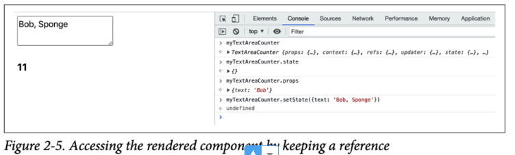

# The Life of a Component
- Bây giờ bạn đã biết cách sử dụng các component DOM có sẵn, đã đến lúc bạn học cách tạo ra component cho riêng mình
- Có 2 cách để định nghĩa 1 component tuỳ chỉnh, cả 2 đều đạt được 1 kết quả nhưng sử dụng cú pháp khác nhau
    - **Sử dụng function**: Các component được tạo ra bằng cách này được gọi là function component
    - **Sử dụng class**: Sử dụng 1 kết thừa từ **React.Component** được gọi là class component
## A Custom Function Component
- Đây là 1 ví dụ về function component
```js
const MyComponent = function() {
  return 'I am so custom';
};
```
- Nhưng chờ đã, đây chỉ là một function! Đúng vậy, đây là custom component chỉ là 1 hàm trả về giao diện người dùng mà bạn muốn. Trong trường hợp này, giao diện người dùng chỉ là text, nhưng bạn thường cần nhiều hơn thế, có thể là một sự kết hợp của các component khác. Đây là ví dụ sử dụng span để bọc text
```js
const MyComponent = function() {
  return React.createElement('span', null, 'I am so custom');
};
```
- Sử dụng component mới của bạn trong App tương tự với cách sử dụng các component DOM từ chương 1, ngoại trừ việc bạn định nghĩa gọi function component
```js
ReactDOM.render(
  MyComponent(),
  document.getElementById('app')
);
```
## A JSX Version
- Cùng ví dụ đó nhưng sử dụng JSX sẽ dễ đọc hơn 1 chút. Định nghĩa component sẽ như thế này
```js
const MyComponent = function() {
  return <span>I am so custom</span>;
};
```
- Sử dụng component theo cách JSX sẽ như thế này, bất kể component đó được định nghĩa như thế nào
```js
ReactDOM.render(
  <MyComponent />,
  document.getElementById('app')
);
```
## A Custom Class Component
- Cách thứ 2 để tạo 1 component là định nghĩa 1 class kế thừa từ React.Component và triển khai 1 hàm render()
```js
class MyComponent extends React.Component {
  render() {
    return React.createElement('span', null, 'I am so custom');
    // or with JSX:
    // return <span>I am so custom</span>;
  }
}
```
- Hiển thị component trên trang
```js
ReactDOM.render(
  React.createElement(MyComponent),
  document.getElementById('app')
);
```
- Nếu bạn sử dụng JSX, bạn không cần biết component được định nghĩa như nào (bằng cách sử dụng class hay function). Trong cả 2 trường hợp, việc sử dụng component là như nhau
```js
ReactDOM.render(
  <MyComponent />,
  document.getElementById('app')
);
```
## Which Syntax to Use?
- Bạn có thể băn khoăn: Với tất cả những lựa chọn này (JSX so với Js thuần, class component so với function component), nên sử dụng cái nào? JSX là phổ biến nhất. Và trừ khi bạn không thích cú pháp XML trong JS của mình, con đường gõ phím ít hơn là sử dụng JSX. Cuốn sách này sử dụng JSX từ bây giờ - trừ khi để minh hoạ 1 khái niệm nào đó
- Vậy tạo sao lại đề cập đến cách không sử dụng JSX? Bạn nên biết rằng có 1 cách khác và JSX không phải là magic mà là 1 lớp cú pháp mỏng chuyển đổi XML thành các cuộc gọi hàm Js đơn giản như React.createElement trước khi gửi code đến trình duyệt
- Còn về class component so với function component? Đây là vấn đề sở thích. Nếu bạn quen thuộc với lập trình hướng đối tượng (OOP) và bạn thích cách bố trí các class thì hãy sử dụng nó.
    - Các function component nhẹ hơn 1 chút trên CPU máy tính của bạn và liên quan đến việc gõ phím ít hơn 1 chút. Chúng cũng tạo cảm giác tự nhiên hơn đối với JS
    - Thực tế, các class không tồn tại trong các phiên bản đầu tiên của của ngôn ngữ Js; chúng chỉ là 1 suy nghĩ muộn và chỉ là đường cú pháp trên đỉnh của các hàm nguyên mẫu
- Theo lịch sử về React, các funtion component không thể thực hiện mọi thứ mà các class có thể làm. Cho đến khi phát minh ra hook, điều mà bạn sẽ được học trong thời gian tới. Về tương lai, người ta chỉ có thể suy đoán nhưng khả năng React sẽ chuyển sang function component nhiều hơn
    - Cuốn sách này dạy bạn cả 2 cách và không đưa ra quyết định thay bạn. Quyết định chọn cách nào là ở bạn
## Properties (Thuộc tính)
- Việc hiển thị UI được mã hoá cứng trong custom component là hoàn toàn ổn và có công dụng của nó. Nhưng các component cũng có thể nhận được thuộc tính và hiển thị hoặc hoạt động khác nhau tuỳ thuộc vào giá trị của thuộc tính. Hãy nghĩ về phần tử <a> trong HTML và cách nó hoạt động khác nhau dựa trên giá trị của thuộc tính href. Ý tưởng về thuộc tính trong React cũng tương tự (Và cú pháp JSX cũng vậy)
- Trong các class component, tất cả các thuộc tính đều có sẵn thông qua đối tượng this.props . Hãy xem ví dụ dưới đây
```js
class MyComponent extends React.Component {
  render() {
    return <span>My name is <em>{this.props.name}</em></span>;
  }
}
```
  - Trong ví dụ này, bạn có thể sử dụng {} để thêm các giá trị và biểu thức trong JSX của bạn. 
- Việc truyền 1 giá trị cho thuộc tính name khi hiển thị component sẽ như thế này
```js
ReactDOM.render(
  <MyComponent name="Bob" />,
  document.getElementById('app')
);
```
- Điều quan trọng cần nhớ là this.props là chỉ đọc. Nó được dùng để truyền cấu hình từ component cha xuống component con, nhưng nó không phải là bộ nhớ chung cho các giá trị. Nếu bạn cảm thấy muốn đặt thuộc tính của this.props, hãy sử dụng các biến cục bộ hoặc thuộc tính của class component của bạn thay vào (có nghĩa là sử dụng this.thing thay vì this.props.thing)
## Properties in Function Components
- Trong các function component, không có this (chế độ nghiêm ngặt của Js) hoặc this  đề cập đến đối tượng toàn cục (trong chế độ không nghiêm ngặt, chúng ta có thể nói đó là chế độ cẩu thả). Vì vậy thay vì this.props, bạn nhận được 1 đối tượng props được truyền vào hàm của bạn dưới dạng đối số đầu tiên
```js
const MyComponent = function(props) {
  return <span>My name is <em>{props.name}</em></span>;
};
```
- Một mẫu phổ biến là sử dụng phép gán destructuring của JS và gán các giá trị thuộc tính cho các biến cục bộ. Nói cách khác, ví dụ trên sẽ trở thành như thế này
```js
const MyComponent = function({name}) {
  return <span>My name is <em>{name}</em></span>;
};
```
- Bạn có thể có bao nhiêu thuộc tính tuỳ thích. Ví dụ nếu bạn cần 2 thuộc tính (name và job) 
```js
const MyComponent = function({name, job}) {
  return <span>My name is <em>{name}</em>, the {job}</span>;
};

ReactDOM.render(
  <MyComponent name="Bob" job="engineer"/>,
  document.getElementById('app')
);
```
## Default properties
- Component của bạn có thể cung cấp 1 số thuộc tính, nhưng đôi khi một số thuộc tính có thể có 1 số giá trị mặc định phù hợp với các trường hợp phổ biến nhất. Bạn có thể chỉ định các giá trị thuộc tính mặc định bằng cách sử dụng thuộc tính defaultProps cho cả class và function
- Đối với funtion component
```js
const MyComponent = function({name, job}) {
  return <span>My name is <em>{name}</em>, the {job}</span>;
};

MyComponent.defaultProps = {
  job: 'engineer',
};

ReactDOM.render(
  <MyComponent name="Bob" />,
  document.getElementById('app')
);
```
- Đối với class component
```js
class MyComponent extends React.Component {
  render() {
    return (
      <span>My name is <em>{this.props.name}</em>,
        the {this.props.job}</span>
    );
  }
}

MyComponent.defaultProps = {
  job: 'engineer',
};

ReactDOM.render(
  <MyComponent name="Bob" />,
  document.getElementById('app')
);
```
- Trong cả 2 trường hợp, kết quả sẽ là
```
My name is Bob, the engineer
```
- Lưu ý:
    - Các câu lệnh return của phương thức **render()** bao bọc giá trị được trả về trong dấu ngoặc đơn. Điều này chỉ vì cơ chế chèn dấu chấm phẩy tự động (ASI) của Js. Một câu lệnh `return` theo sau 1 dòng mới giống như `return ;` mà cũng giống như **return undefined;** điều này chắc chắn không phải là điều bạn muốn. Việc bao bọc biểu thức được trả về trong dấu ngoặc đơn cho phép định dạng code tốt hơn trong khi vẫn giữ được tính chính xác
## State
- Các ví dụ cho đến nay khá tĩnh (hoặc không trạng thái). Mục tiêu chỉ là cung cấp cho bạn một ý tưởng về các block để xây dựng giao diện người dùng của bạn. Nhưng nơi React thực sự toả sáng (và nơi việc thao tác và bảo trì DOM của trình duyệt theo cách cũ trở nên phức tạp) là khi dữ liệu trong ứng dụng của bạn thực sự thay đổi
- React có khái niệm về state, đó là bất kỳ dữ liệu nào mà các component muốn sử dụng để hiển thị chính mình. Khi state thay đổi, React sẽ xây dựng lại UI người dùng trong DOM mà bạn không cần phải làm gì. Sau khi bạn xây dựng giao diện người dùng ban đầu trong phương thức `render()` của mình (hoặc trong hàm hiển thị trong trường hợp function component), tất cả những gì bạn quan tâm là cập nhật dữ liệu. Bạn không cần phải lo lắng về việc thay đổi giao diện người dùng chút nào. Sau cùng phương thức/hàm `render()` của bạn đã cung cấp bản thiết kế về các component trông thế nào
    - **“Stateless (không trạng thái)” không phải là 1 từ xấu, không hề. Các component stateless dễ quản lý và suy nghĩ hơn nhiều. Tuy nhiên trong khi việc sử dụng stateless bất cứ khi nào có thể là tốt hơn, các ứng dụng phức tạp cần state**
- Tương tự như cách bạn truy cập thuộc tính thông qua **this.props**, bạn đọc **state** thông qua đối tượng **this.state**. Để cập nhật state, bạn sử dụng **this.setState()**. Khi **this.setState** được gọi, React sẽ gọi phương thức **render()** của component của bạn (và các component con của nó) và cập nhật UI người dùng
- Các cập nhật đối với UI người dùng sau khi gọi **this.setState()** được thực hiện bằng cách sử dụng cơ chế xếp hàng hiệu quả để xử lý các thay đổi theo lô. Việc cập nhật `this.state` trực tiếp có thể dẫn đến lỗi không mong muốn và bạn không nên làm điều đó. Tương tự như this.props, hãy xem đối tượng this.state chỉ là đọc, không chỉ về mặt ngữ nghĩa nó là 1 ý tưởng không hay mà còn vì có thể hoạt động theo những cách mà bạn không mong đợi. Tương tự, đừng bao giờ tự gọi `this.render()` - thay vào đó, hãy để React xử lý các thay đổi theo lô, tìm ra lượng công việc tối thiểu và gọi `render()` khi và nếu cần thiết.
## A textarea Component
- Hãy cùng tạo 1 component mới - Một textarea đếm số lượng kí tự được nhập vào
- Bạn (cũng như những người sử dụng component có thể tái sử dụng trong tương lai) có thể sử dụng component mới như sau
  ```js
  ReactDOM.render(
    <TextAreaCounter text="Bob" />,
    document.getElementById('app')
  );
  ```
- Bây giờ hãy triển khai component. Đầu tiên hãy tạo 1 phiên bản stateless (không trạng thái) không xử lý các cập nhật; điều này không khác biệt nhiều so với các ví dụ trước
  ```js
  class TextAreaCounter extends React.Component {
    render() {
      const text = this.props.text;
      return (
        <div>
          <textarea defaultValue={text}/>
          <h3>{text.length}</h3>
        </div>
      );
    }
  }

  TextAreaCounter.defaultProps = {
    text: 'Count me as I type',
  };
  ```
  - Bạn có thể nhận thấy rằng `<textarea>` trong đoạn code trên sử dụng thuộc tính defaultValue trái ngược với `text` bạn thường thấy trong HTML thông thường. Điều này là do có 1 số khác biệt nhỏ giữa React và HTML khi nói đến form element. Chúng ta sẽ được thảo luận kỹ hơn trong cuốn sách - hãy yên tâm, không có quá nhiều sự khác biệt
- Như bạn đã thấy, component `TextAreaCounter` nhận 1 thuộc tính chuỗi văn bản text và hiển thị 1 `textarea` với giá trị được cho, cũng như phần tử <h3> sẽ hiển thị đỗ dài của chuỗi. Nếu `text` không được cung cấp, giá trị mặc định **Count me as I type** sẽ được sử dụng
## Make It  Stateful 
- Bước tiếp theo là biến component không trạng thái thành có trạng thái. Hay nói cách khác, hãy để component duy trì 1 số dữ liệu (trạng thái) và sử dụng dữ liệu này để hiển thị chính nó và sau đó cập nhật chính nó (render lại) khi dữ liệu thay đổi
- Đầu tiên, bạn cần đặt state ban đầu trong hàm tạo lớp bằng `this.state` . Hãy nhớ rằng hàm tạo (constructor) là nơi duy nhất bạn có thể đặt state trực tiếp mà không cần phải gọi **this.setState()**
- Khởi tạo **this.setState** là bắt buộc; nếu bạn không làm điều đó, việc truy cập liên tục vào **this.state** trong phương thức **render()** sẽ thất bại
- Trong trường hợp này, việc khởi tạo **this.state.text** là không cần thiết vì bạn có thể sử dụng thuộc tính **this.props.text**
  ```js
  class TextAreaCounter extends React.Component {
    constructor() {
      super();
      this.state = {};
    }

    render() {
      const text = 'text' in this.state ? this.state.text : this.props.text;
      return (
        <div>
          <textarea defaultValue={text} />
          <h3>{text.length}</h3>
        </div>
      );
    }
  }
  ```
  - Gọi super() trong constructor là bắt buộc trước khi bạn có thể sử dụng this
- Dữ liệu mà component này duy trì là nội dung của textarea vì vậy state chỉ có 1 thuộc tính gọi là text - có thể truy cập thông qua this.state.text . Tiếp theo, bạn cần cập nhật state. Bạn có thể sử dụng 1 phương thức trợ giúp cho mục đích này
  ```js
  onTextChange(event) {
    this.setState({
      text: event.target.value,
    });
  }
  ```
- - Bạn luôn cập nhật state bằng `this.setState()` , hàm này nhận 1 object và hợp nhất nó với dữ liệu đã tồn tại trong **this.state.** Như bạn có thể đoán, **onTextChange()** là 1 trình xử lý sự kiện nhận vào 1 event object và truy cập vào nó để lấy nội dung của đầu vào textarea
- Điều cuối cùng cần làm là cập nhật phương thức **render()** để thiết lập event handler
  ```js
  render() {
    const text = 'text' in this.state ? this.state.text : this.props.text;
    return (
      <div>
        <textarea
          value={text}
          onChange={event => this.onTextChange(event)}
        />
        <h3>{text.length}</h3>
      </div>
    );
  }
  ```
- Bây giờ, bất cứ khi nào người dùng gõ vào textarea, giá trị của bộ đếm sẽ được cập nhật để phản ánh nội dung
- Lưu ý rằng trước đây bạn có `<textarea defaultValue...>` , giờ đây là `<textarea value...>` trong đoạn code trên. Điều này là do cách thức hoạt động của các đầu vào trong HTML, nơi state của chúng ta được duy trì bởi trình duyệt. Nhưng React có thể làm tốt hơn. Trong ví dụ này, việc triển khai **onChange** có nghĩa là textarea hiện được kiểm soát bởi React. Bạn sẽ được tìm hiểu thêm về các component được kiểm soát (controlled components) trong các chương sau của cuốn sách
## A Note on DOM Events
- Để tránh nhầm lẫn, cần làm rõ 1 vài điểm về dòng code sau
```js
onChange={event => this.onTextChange(event)}
```
- React sử dụng hệ thống sự kiện tổng hợp (synthetic events) của riêng mình để cải thiện hiệu suất. Để hiểu rõ lý do, bạn cần xem xét cách thức hoạt động trong thế giới DOM thuần tuý
### Event Handling in the Olden Days
- Việc sử dụng event handler nội tuyến để thực hiện những việc như thế này là rất thuận tiện
```js
<button onclick="doStuff">
  ```
- Mặc dù thuận tiện và dễ đọc (event listeners nằm ngay bên cạnh code UI), việc có quá nhiều event listener phân tán như vậy là không hiệu quả. Cũng khó để có nhiều hơn 1 event listener trên 1 button, đặc biệt là nếu button đó nằm trong “component” hoặc thư viện của người khác và bạn không muốn vào sửa hoặc fork code của họ
- Đó là lý do tại sao trong thế giới DOM, việc sử dụng `element.addEventListener` để thiết lập event listener (Hiện tại dẫn đến việc có code ở 2 nơi trở lên) và uỷ thác sự kiện (để giải quyết các vấn đề về hiệu suất) là phổ biến.
- Uỷ thác sự kiện có nghĩa là bạn lắng nghe các sự kiện ở 1 nút cha. Ví dụ như một `<div>` chứa nhiều nút và bạn thiết lập event listener cho tất cả các nút, thay vì một event listener cho mỗi nút. Do đó, bạn uỷ thác việc xử lý sự kiện cho mỗi cơ quan quản lý cấp trên
- Với uỷ thác sự kiện, bạn thực hiện điều gì đó như thế này:
```js
<div id="parent">
  <button id="ok">OK</button>
  <button id="cancel">Cancel</button>
</div>

<script>
  document.getElementById('parent').addEventListener('click', function(event) {
    const button = event.target;
    // thực hiện các hành động khác nhau dựa trên nút nào được nhấp
    switch (button.id) {
      case 'ok':
        console.log('OK!');
        break;
      case 'cancel':
        console.log('Cancel');
        break;
      default:
        new Error('Unexpected button ID');
    };
  });
</script>
```
- Cách này hoạt động và hiệu suất tốt, nhưng có những nhược điểm:
    - Khai báo event listener ở xa component UI: Điều này khiến code khó tìm và gỡ lỗi hơn
    - Sử dụng uỷ thác và luôn chuyển đổi(switch): Tạo ra code mẫu không cần thiết ngay cả trước khi bạn thực hiện công việc thực sự (phản hồi khi nhấp vào nút trong trường hợp này)
    - Sự không nhất quán của trình duyệt: Thực tế yêu cầu code này phải dài hơn (không được đề cập ở đây)
- Thật không may, khi nói đến việc đưa code này vào hoạt động trước người dùng thực, bạn cần thêm 1 vài điều nữa nếu bạn muốn các browser cũ hỗ trợ
    - Bạn cần `attachEvent` ngoài và `addEventListener`
    - Bạn cần const `event = event || windown.event` ở đầu trình nghe
    - Bạn cần `const button = [event.target](http://event.target) || event.srcElement`
- Tất cả những điều này là cần thiết và đủ khó chịu đến nỗi bạn sẽ kết thúc bằng việc sử dụng 1 thư viện xử lý các sự kiện nào đó. Nhưng tại sao lại thêm 1 thư viện nữa (và học thêm API) khi React được tích hợp sẵn một giải pháp cho những cơn ác mộng của event handler?
## Event Handling in React
- React sử dụng sự kiện tổng hợp (synthetic events) để gom góp các event từ browser, loại bỏ hết các sự bất đồng, có nghĩa là không còn sự không nhất quán của browser nữa. Bạn sẽ luôn có thể sử dụng [`event.target`](http://event.target) một cách *ngon lành* trên mọi browser. Nói nôm na là bạn chả phải lo gì nữa, code của bạn sẽ chạy mượt trên mọi thiết bị
- Ví dụ, trong đoạn code `TextAreaCounter` bạn chỉ cần sử dụng **event.target.value** và mọi thứ sẽ hoạt động trơn tru. Điều này có nghĩa là API để huỷ các event cũng giống nhau trên các browser, đơn giản là `event.stopPropagation()` và `event.preventDefault()` sẽ hoạt động ngay cả trên những phiên bản Internet Explorer hơi cũ
- Cú pháp trong React cũng dễ dàng giữ UI và các event listener gần nhau. Nó trông giống như các event handler cổ điển được nhúng trực tiếp vào HTML. Nhưng thực tế thì React đang sử dụng sự kiện uỷ thác (event delagation) để tăng hiệu suất
- React sử dụng camelCase cho các event handler, nên bạn sẽ sử dụng `onClick` thay cho `onclick`
- Nếu bạn cần sự kiện gốc của browser vì bất cứ lý do gì, bạn có thể truy cập thông qua `event.nativeEvent` nhưng rất ít khi sử dụng nó
- Và 1 điều nữa, event **onChange()** (như được sử dụng trong ví dụ Textare) sẽ hoạt động như bạn mong đợi, nó sẽ kích hoạt khi người dùng typing, thay vì khi họ nhập xong và di chuyển ra khỏi input như DOM thông thường
- **Việc sử lý event trong React dễ như đớp bánh, bạn sẽ không cần phải “đau đầu” với các trình duyệt khác nhau nữa**
## Event-Handling Syntax
- Trong ví dụ trước, chúng ta đã sử dụng arrow function để gọi hàm onTextChange()
```js
onChange={event => this.onTextChange(event)}
```
- Lý do đơn giản là cú pháp `onChange={this.onTextChange}` sẽ không hoạt động
- Có 1 lựa chọn khác là ràng buộc (bind)
```js
onChange={this.onTextChange.bind(this)}
```
- Và còn 1 cách nữa là bind tất cả các event handler trong constructor
```js
constructor() {
  super();
  this.state = {};
  this.onTextChange = this.onTextChange.bind(this);
}

// ...

<textarea
  value={text}
  onChange={this.onTextChange}
/>
```
- Đây là 1 chút code mẫu cần thiết, nhưng cách này giúp ràng buộc event handler chỉ 1 lần duy nhất thay vì mỗi lần hàm `render()` được gọi. Điều này giúp làm giảm thiểu bộ nhớ của ứng dụng
- Cách làm phổ biến này đã được thay thế phần lớn bởi khả năng sử dụng hàm như thuộc tính trong class Js
```js
// truoc
class TextAreaCounter extends React.Component {
  constructor() {
    // ...
    this.onTextChange = this.onTextChange.bind(this);
  }

  onTextChange(event) {
    // ...
  }
}
```
```js
// sau
class TextAreaCounter extends React.Component {
  constructor() {
    // ...
  }

  onTextChange = (event) => {
    // ...
  };
}
```
- **Tóm lại, bí mật của this trong React là phải ràng buộc đúng cách để đảm bảo rằng nó trỏ đến đối tượng lớp, tránh tình trạng this trỏ lung tung gây ra lỗi khó hiểu**
## Props Versus State
- Bạn đã biết rằng có thể truy cập `this.props` và `this.state` trong phương thức `render()` để hiển thị component. Nhưng làm thế nào để biết được khi nào sử dụng props, khi nào sử dụng state?
- **Props** là cơ chế để người dùng component cấu hình component của bạn. Nó giống như những thông tin được truyền vào component từ bên ngoài
- **State** là dữ liệu nội bộ của component, dùng để quản lý state của nó
- Để hiểu rõ hơn, hãy tưởng tượng một ví dụ về lập trình hướng đối tượng
    - `this.props` giống như tập hợp các đối số được truyền vào constructor
    - `this.state` giống như túi chứa các thuộc tính riêng tư của class
- **Hãy cố gắng chia nhỏ ứng dụng của bạn thành nhiều component không state (stateless) và có ít component có trạng thái (stateful) hơn**
- Ví dụ:
    - Một component hiển thị danh sách các sản phẩm sẽ nhận `props` là mảng các sản phẩm từ component cha
    - Component này sẽ có `state` để quản lý trạng thái hiển thị của danh sách (danh sách đang được sắp xếp theo giá, đang được lọc theo loại,…)
- **Tóm lại `props` là thông tin từ bên ngoài, `state` là thông tin nội bộ. Hãy sử dụng `props` để cấu hình component và `state` để quản lý trạng thái của component**
## Props in Initial State: an Antipattern
- Trong ví dụ Textarea trước, rất dễ để sử dụng this.props để thiết lập giá trị ban đầu cho this.state
```js
// Cảnh báo: Mẫu thiết kế phản tác dụng
this.state = {
  text: props.text,
};
```
- Đây được gọi là anti-pattern. Bạn nên sử dụng kết hợp `this.props` và `this.state` để xây dựng UI trong phương thức `render()`
- Mặc dù không có gì sai khi sử dụng props để thiết lập intitial cho state, nhưng điều này có thể dẫn đến kỳ vọng sai lệch từ phía người gọi component. Người gọi component có thể mong đợi giá trị của `props` (vd text ở ví dụ trên) luôn là giá trị mới nhất, nhưng mã trên không đáp ứng kỳ vọng này
- Để giải quyết vấn đề này, bạn có thể thay đổi tên của props thành 1 cái gì đó như `defaultText` hoăc initialValue thay vì chỉ là text
```js
// Cách tốt hơn
this.state = {
  text: this.props.defaultText,
};
```
## Accessing the Component from the Outside
- Bạn không phải lúc nào cũng có cơ hội bắt đầu 1 ứng dụng React từ đầu. Đôi khi bạn phải kết nối với 1 ứng dụng hoặc 1 trang web hiện có và di chuyển sang React từng phần 1. May mắn thay, React được thiết kế để hoạt động với bất kỳ cơ sở code nào đã tồn tại
- Rốt cuộc, nhưng người tạo ra React ban đầu cũng không thể dừng hết lại và viết hoàn toàn lại 1 ứng dụng khổng lồ(facebook.com) từ đầu, đặc biệt là trong những ngày React còn non trẻ
- Một cách để ứng dụng React của bạn giao tiếp với thế giới bên ngoài là lấy 1 tham chiếu đến component được render bằng React.DOM.render() và sử dụng nó từ bên ngoài component
```js
const myTextAreaCounter = ReactDOM.render(
  <TextAreaCounter text="Bob" />,
  document.getElementById('app')
);
```
- Bây giờ bạn có thể sử dụng myTextAreaCounter để truy cập các phương thức và thuộc tính giống như bạn thường làm với this bên trong component. Bạn thậm chí có thể tương tác với component bằng cách sử dụng console.log của Js(myTextAreaCounter.props, myTextAreaCounter.state,…)

- Trong ví dụ này, myTextAreaCounter.state kiểm tra state (ban đầu là trống); myTextAreaCounter.props kiểm tra các thuộc tính và dòng bên dưới thiết lập state mới
```js
myTextAreaCounter.setState({text: "Hello outside world!"});
```
- Dòng này lấy tham chiếu đến node DOM cha chính mà React tạo ra
```js
const reactAppNode = ReactDOM.findDOMNode(myTextAreaCounter);
```
- Đây là con đầu tiên của `<div id='app'>` nơi bạn bắt React thực hiện pháp thuật của nó
- Bạn có thể truy cập toàn bộ API của component từ bên ngoài, nhưng hãy sử dụng siêu năng lực này 1 cách tiết kiệm, nếu có thể. Có thể bạn sẽ muốn “lục lọi” state của các component mà bạn không sở hữu và “sửa chữa” chúng, nhưng điều này sẽ vi phạm kỳ vọng và gây ra lỗi trong tương lai vì component không đoán được những sự can thiệp như vậy
- Tóm lại, bạn có thể truy cập component từ bên ngoài bằng cách giữ 1 tham chiếu đến component được render Tuy nhiên hãy sử dụng cách này thật thận trọng để tránh gặp các lỗi không mong muốn

