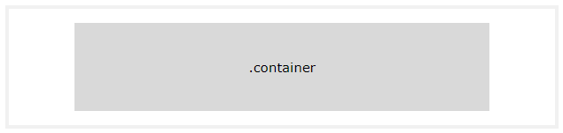
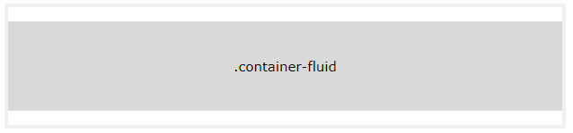
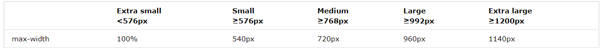
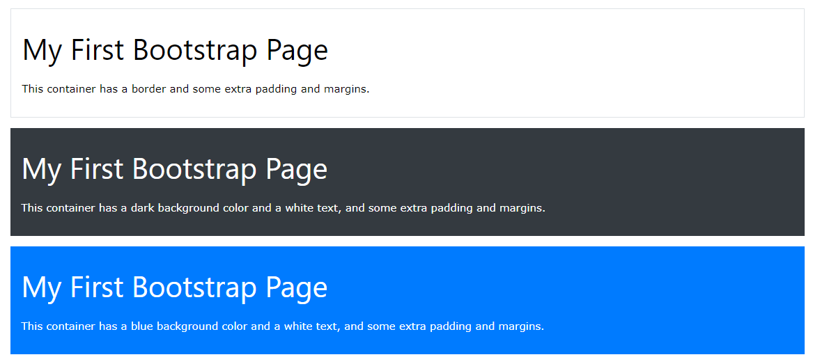
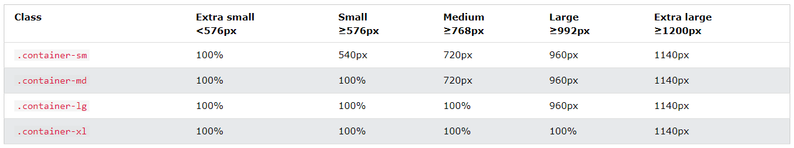

# Boostrap là gì
- Boostrap là 1 front-end framework free để phát triển web nhanh và dễ dàng hơn 
- Gồm các mẫu thiết kế dựa trên HTML & css cho typography, forms, buttons, tables, navigation, modals, image carousels and many other
- Giúp dễ dàng tạo ra các thiết kế đáp ứng
- Lý do nên dùng: 
    - Dễ sử dụng
    - Hỗ trợ responsive
    - Tương thích với all trình duyệt hiện đại

# Boostrap container

## Container
- Yêu cầu 1 phần tử chứa để bao bọc nội dung trang web
- Vùng chứa để đệm nội dung bên trong & có sẵn 2 lớp vùng chứa
    - .container: Lớp cung cấp vùng chứa có chiều rộng cố định đáp ứng
    
    - .container-fluid: Cung cấp vùng chứa có chiều rộng đầy đủ mở rộng toàn bộ chiều rộng của khung nhìn
    
## Fixed Container
- Sử dụng .container để tạo 1 vùng chứa đáp ứng có chiều rộng cố định
- max-width sẽ thay đổi trên các kích thước màn hình khác nhau

## Fluid Container
- Tạo vùng chứa có chiểu rộng đầy đủ. Vùng chứa sẽ luôn kéo dài toàn bọ chiều rộng của màn hình (Luôn là 100%)
## Container Padding
- Mặc định vùng chứa có phần đệm bên trái và phải là 15px k có trên dưới
- Sử dụng .pt-3 để phần đệm trên cùng là 16px
    ```html
    <div class="container pt-3"></div> 
    ```
## Container Border and Color
- Các đường viền và màu cũng thường được sử dụng với các container
    ```html
    <div class="container p-3 my-3 border">Có đường viền và margin & paddding</div>

    <div class="container p-3 my-3 bg-dark text-white">Màu nền đen và text trắng, cùng margin & paddding</div>

    <div class="container p-3 my-3 bg-primary text-white">Màu nền blue và text trắng, cùng margin & paddding</div>
    ```
    
## Responsive Containers
- Sử dụng các lớp .container-sm | md | lg | xl để tạo vùng chứa đáp ứng
- Chiều rộng tối đa của vùng chứa thay đổi trên kích thước màn hình khác nhau
    ```html
    <div class="container-sm">.container-sm</div>
    <div class="container-md">.container-md</div>
    <div class="container-lg">.container-lg</div>
    <div class="container-xl">.container-xl</div>
    ```
    