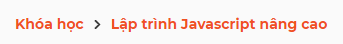
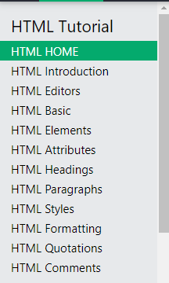

## Bài 1: Dựng source base
- Tạo 2 file
    - base.css để cấu hình chung
    - main.css để css nhữn thành phần riêng
## Bài 2: Reset css
- Dùng normalize cdn (Thư viện reset css)
## Bài 3: Navbar

## Bài 5: Font-icon
- Download font-awesome
- Link vào head 
- Dùng <i> để thêm icon
```html
<i class="fab fa-facebook"></i>
```
## Header QR
- Có 2 cách để gọi phần tử đầu tiên
    - Dùng lớp giả :first-child
    - Dùng  :nth-child(1) (Cách fix cứng, sử dụng khi class không thay đổi)
    ```css
    header__qr-link:nth-child(1){

    }
    ```
```css
.header__navbar-item--has-qr:hover .header__qr {
    /* Css được viết trong đc apply vào header__qr khi hover vào cha của nó */
}
```
- object-fit: Giống thuộc tính background size 
- Tạo ra mũi tên góc 
```css
border-color: transparent transparent var(--white-color) transparent;
```


## Base Model 
- Tạo ra lớp phủ trên trang web 
    - Tạo ra modal để chiếm hết màn hình
    - Tạo ra lớp overlay để hiển thị lớp mờ mờ có thể nhìn xuyên qua 
- Thuộc tính z-index dùng trong trường hợp nhiều tầng đè lên nhau. Ông nào có z-index cao nhất thì lên trên 

## Phân tích giao diện web 
- Phân tích
    - Header
    - Slider
    - Content
        - About
        - Tour
        - Contact
        - Image
        - Footer
- Dựng base
- Xây dựng theo từng phần phân tích
- Hoàn thiện
 ### Phân biệt và gọi tên thành phần (Phân tích)
 - Những thành phần thường gặp trên giao diện website:
    - Header(Đầu trang)
    - Navication (Điều hướng)
    - Beadcrumb (Chỉ cho đang ở đâu trên website)
    
    - Sidebar (Các thanh hiển thị ở bên trái hoặc phải website )
    
    - Slider 
    - Banner
    - Content
    - Footer