## Flexbox là gì?

- Là 1 one-dimensional layout pattern giúp thiết kế layout linh hoạt và hiệu quả 
- Phân chia không gian giữa các item 
- Dễ dàng sắp xếp các item từ trái sang phải, trên xuống dưới 
- Kiểm soát khoảng cách và thứ tự của các item trong container

## Cấu trúc của Flexbox
- Có 2 thành phần chính là flex container & flex items 
- 1 số thuộc tính cần quan tâm: 
    - main axis: Trục này là hướng của các item hiển thị. Mặc định chạy từ trái qua phải
    - cross axis: Vuông góc với main axis. Chạy từ trên xuống dưới 
    - main size: Kích thước của mỗi item dựa theo trục main axis
    - cross size: Kích thước của mỗi item dựa theo trục cross axis

## Các thuộc tính của flex container
- display: Định nghĩa 1 flex container (Cho lên 1 hàng ngang)
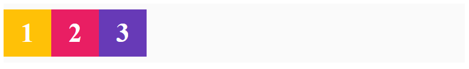
- flex-direction: Dùng để chỉ định các hướng hiển thị của item (Thay đổi hướng hiển thị cũng có thể cho phép thay đổi vị trí của các flex item)
- flex-direction: row : Giá trị mặc định của flexbox đặt item từ trái qua phải theo trục chính 

- flex-direction: row-reverse: Ngược lại với row 
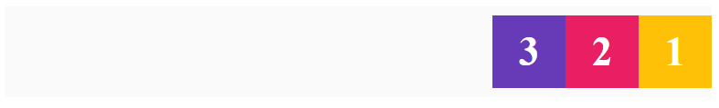
- flex-direction: column : Từ trên xuống dưới 
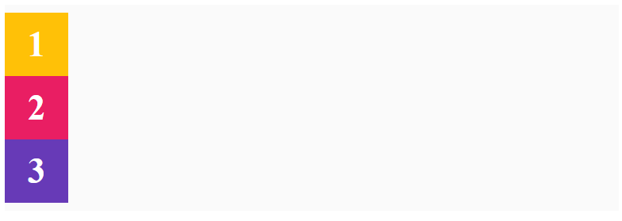
- flex-direction: column-reverse : Từ dưới lên trên 
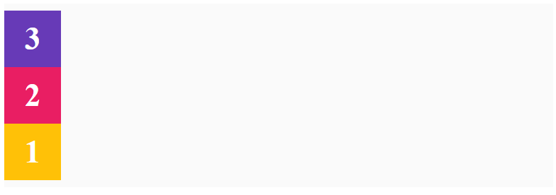
- flex-wrap: Kiểm soát việc bọc các items nằm gọn trong container
- flex-wrap: no-wrap : Mặc định không có gì thay đổi
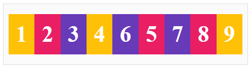
- flex-wrap: wrap : Các item được bọc trong container (Phần tử đẩy xuống dưới)
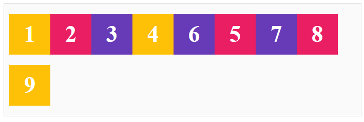
- flex-wrap: wrap-reverse : Các item được bọc trong container (Phần tử đẩy lên trên)
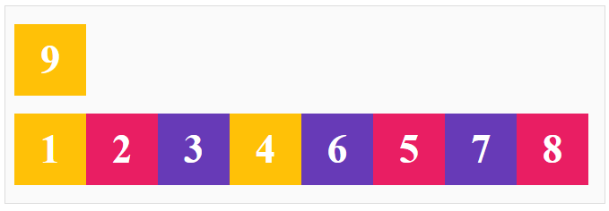
- flex-flow: Là cú pháp rút gọn của flex-direction & flex-wrap (Giá trị đầu là direction & sau là wrap)

- justify-content: Dùng để căn chỉnh vị trí các items so với trục chính (main axis)
- Có 6 thuộc tính: 
    - flex-start: Bắt đầu từ main start
    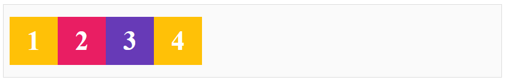
    - flex-end: Đặt item bắt đầu từ main end
    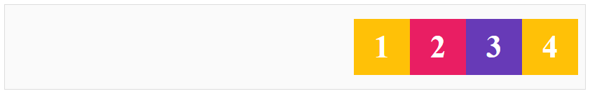
    - center: Đặt item ở giữa trục main axis
    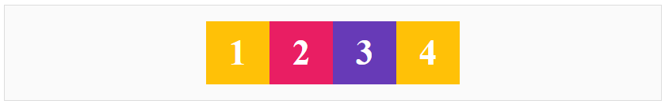
    - space-between: Chia đều các khoảng cách thừa & thêm nó vào giữa các item
    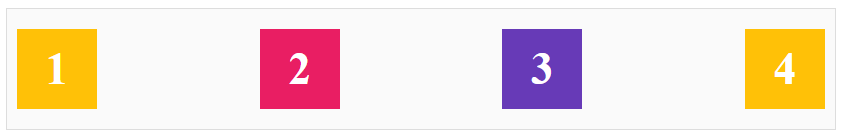
    - space-around: Chia khoảng cách ở đầu & cuối. Khoảng cách ở đầu & cuối bằng 1 nửa khoảng cách giữa 2 item
    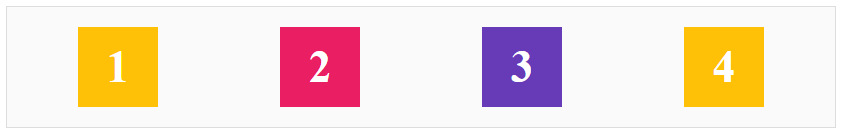
    - space-evenly: Chia đều khoảng cách giữa các item với nhau
    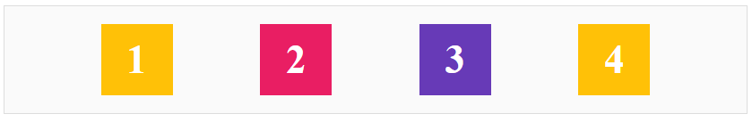

## align-items
- Thuộc tính align-items dùng để xác định các flex item được đặt trong container dọc theo chiều cross axis
    - align-items: stretch : Chiều dài item bằng chiều dài của cross axits
    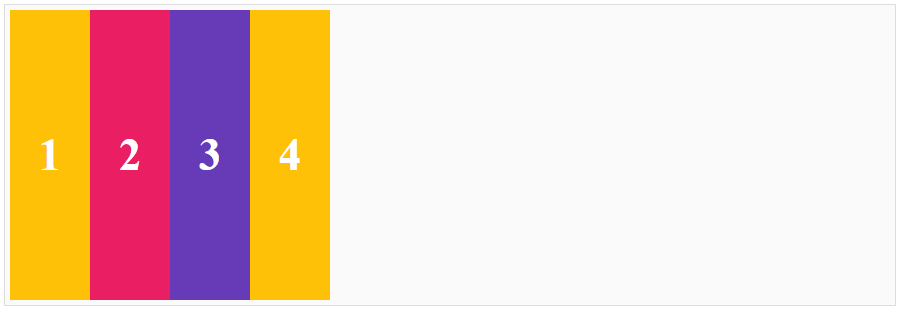
    - align-items: flex-start : Item được đặt bắt đầu bằng chiều dài của cross start(trên cùng bên trái, kích thước không đổi)
    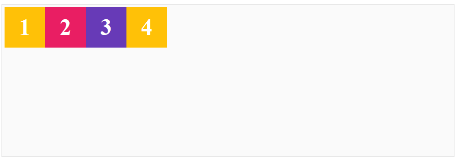
    - align-items: flex-end : Đặt ở điểm bắt đầu của cross end (Dưới cùng bên trái)
    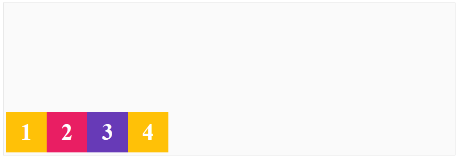
    - align-items: center : Đặt ở giữa điểm bắt đầu của cross start và điểm bắt đầu của cross end (giữa bên trái)
    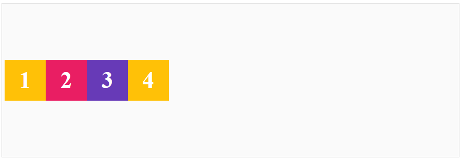
    - align-items: baseline : Item được đặt dữ theo các ký tự thuộc item đó (Mục đích căn chỉnh dữ liệu dòng văn bản các item)
    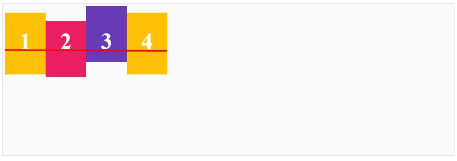

## align-content
 - Giống với justify-content chỉ khác là align-content căn theo trục cross axis 

