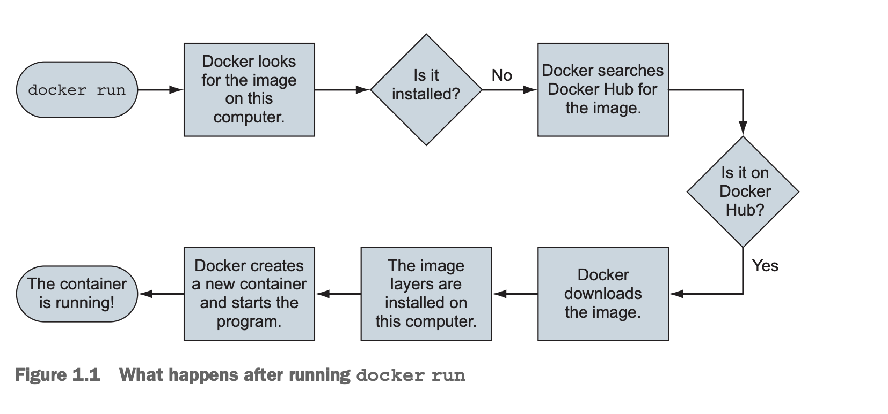
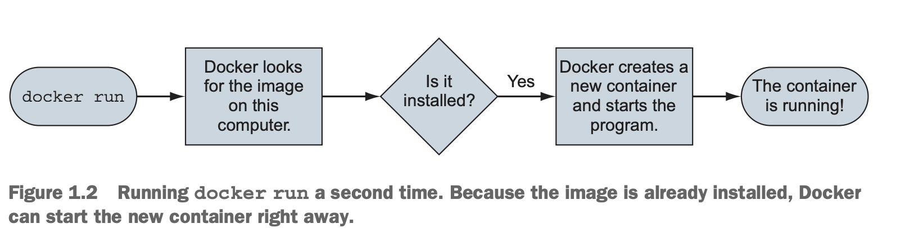
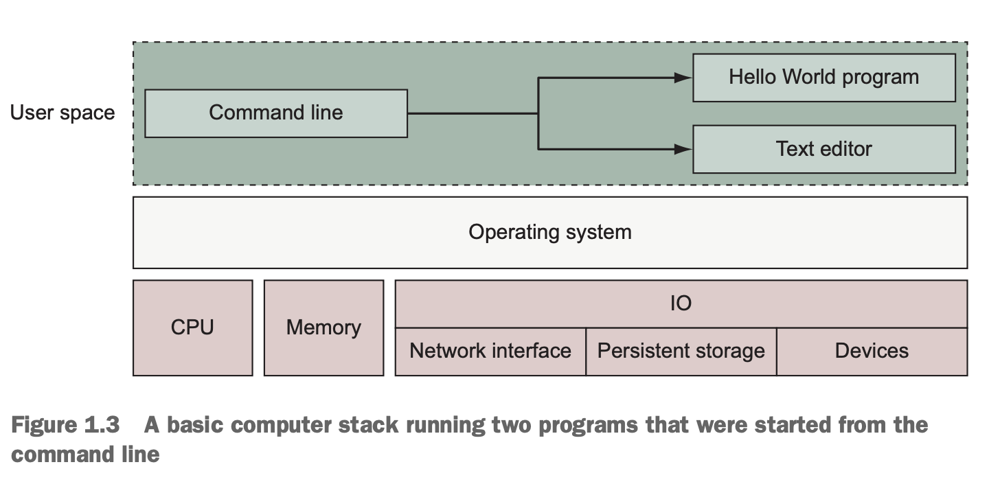
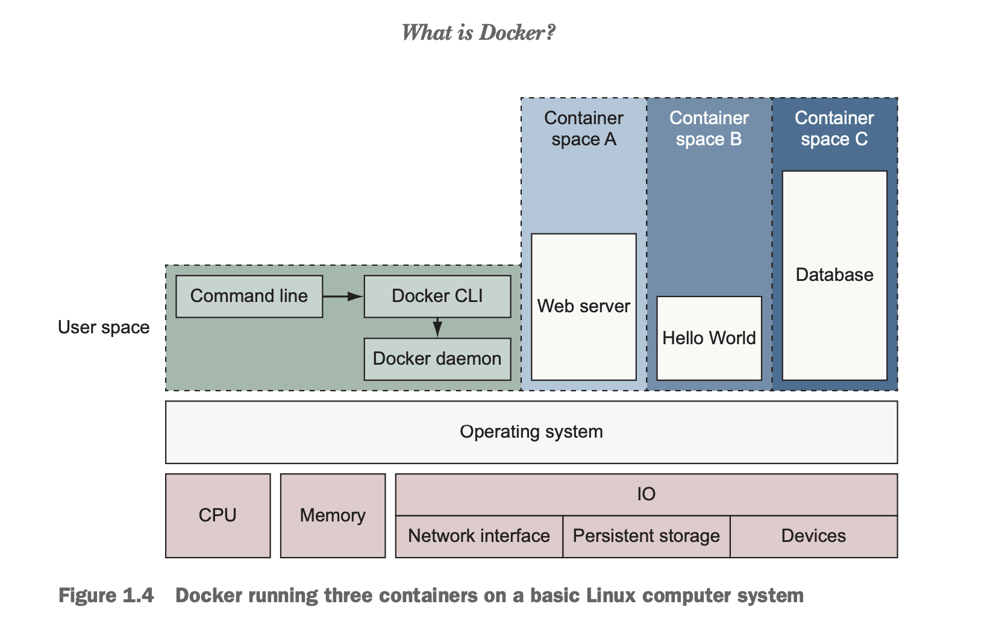
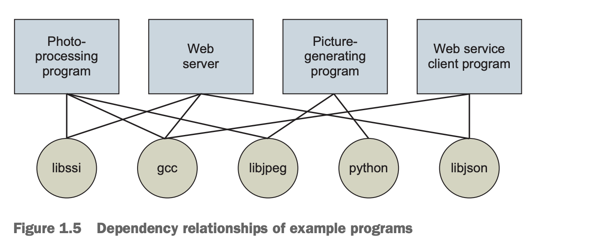
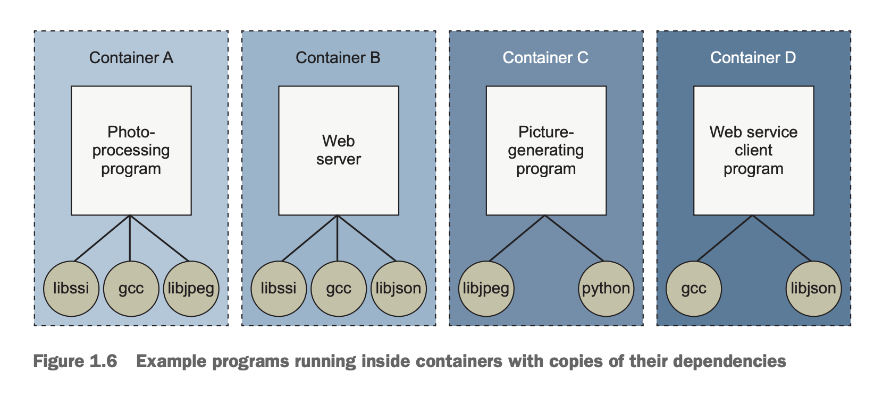

# Chapter 1: Welcome to Docker
- Chapter này bao gồm:
  - Giới thiệu Docker là gì
  - Ví dụ: "Hello, World"
  - Giới thiệu về container
  - Docker giải quyết các vấn đề phần mềm mà hầu hết mọi người đều gặp phải như thế nào
  - Khi nào, ở đâu và tại sao nên sử dụng Docker

- Cách thực hành tốt nhất là khi bạn bỏ công sức vào sản phẩm hoặc hệ thống của mình, dù không bắt buộc, để sau này mọi thứ sẽ tốt hơn. Các biện pháp thực hành tốt nhất giúp tăng cường bảo mật, ngăn ngừa xung đột, cải thiện khả năng phục vụ hoặc tăng tuổi thọ. Các biện pháp thực hành tốt nhất thường chi phí trước mắt có thể nhiều. Điều này đặc biệt đúng khi tương lai của hệ thống hoặc sản phẩm không chắc chắn. `Docker` là 1 công cụ giúp việc áp dụng các biện pháp đóng gói, phân phối và sử dụng phần mềm trở nên rẻ và hợp lý hơn. Nó thực hiện điều đó bằng cách cung cấp tầm nhìn hoàn chỉnh cho các container chứa quy trình & công cụ đơn giản để xây dựng và làm việc với chúng
- Nếu bạn đang ở trong 1 nhóm vận hành phần mềm dịch vụ với các yêu cầu mở rộng dynamic requirements, triển khai phần mềm với Docker có thể giúp giảm tác động đến khách hàng. Các container xuất hiện nhanh hơn và tiêu tốn ít tài nguyên hơn so với máy ảo
- Các team lập trình dùng CI/CD (tích hợp và triển khai liên tục) mà kết hợp với Docker, họ sẽ tạo ra được quy trình làm việc rõ ràng, dễ tuỳ chỉnh hơn và đồng thời xây dựng được môi trường test đáng tin cậy hơn. Container test chứa cùng phần mềm với phần mềm thực tế. Kết quả là sự tự tin thay đổi trên PRD cao hơn, kiểm soát thay đổi PRD chặt chẽ hơn & làm nhanh hơn
- Nếu team bạn sử dụng Docker để mô hình hoá ở local, bạn sẽ giảm thời gian onboarding của nhân viên mới & bỏ được những cái không nhất quán. Những môi trường tương tự đó có thể kiểm soát phiên bản bằng phần mềm & được cập nhật khi các yêu cầu về phần mềm thay đổi
- Các những người viết ra phần mềm thường biết cách cài đặt & cấu hình phần mềm của họ với các mặc định hợp lý và các phụ thuộc cần thiết. Nếu bạn viết phần mềm đó với Docker, việc phân phối phần mềm đó với Docker sẽ giúp người dùng của bạn cài đặt và chạy phần mềm dễ dàng hơn. Họ có thể tận dụng cấu hình mặc định và tài liệu trợ giúp mà bạn đưa vào. Nếu bạn sử dụng Docker, bạn có thể thu gọn "Hướng dẫn cài đặt" sản phẩm của mình thành 1 lệnh duy nhất và 1 phụ thuộc di động duy nhất
- Trong khi những người viết ra phần mềm hiểu được sự phụ thuộc, cài đặt & đóng gói, thì quản trị viên hệ thống mới là người hiểu được hệ thống mà phần mềm sẽ chạy. Docker cung cấp một ngôn ngữ biểu cảm để chạy phần mềm trong các container. Ngôn ngữ đó cho phép người quản trị hệ thống đưa cấu hình cụ thể cho môi trường và kiểm soát chặt chẽ quyền truy cập vào tài nguyên hệ thống. Cùng ngôn ngữ đó, kết hợp với quản lý gói tích hợp, công cụ và cơ sở hạ tầng phân phối, giúp triển khai có tính khai báo, có thể lặp lại & đáng tin cậy. Nó thúc đẩy mô hình hệ thống dùng 1 lần, cô lập trạng thái liên tục và các biện pháp thực hành tốt nhất khác giúp quản trị viên hệ thống tập chung vào các hoạt động có giá trị cao hơn
- Ra mắt vào tháng 3/2013, Docker hoạt động với hệ điều hành của bạn để đóng gói, vận chuyển và chạy phần mềm. Bạn có thể coi Docker như 1 nhà cung cấp dịch vụ hậu cần phần mềm giúp bạn tiết kiệm thời gian và tập chung vào các phần cốt lõi. Bạn có thể sử dụng Docker với các ứng dụng mạng như web server, database & mail server và các terminal application gồm trình soạn thảo văn bản, trình biên dịch, công cụ phân tích mạng & scripts. Trong 1 số trường hợp, nó thậm chí còn được sử dụng để chạy các ứng dụng GUI như trình duyệt web và productivity software
- Docker chạy phần mềm Linux trên hầu hết các hệ thống. Docker cho Mac & Windows tích hợp với công nghệ máy ảo (VM) phổ biến để có thể chạy được phần mềm Linux. Nhưng trên máy chủ windows mới, Docker có thể chạy thẳng ứng dụng Windows
- Docker không phải là ngôn ngữ lập trình và cũng không phải là framework để xây dựng phần mềm. Docker là 1 công cụ giúp giải quyết các vấn đề phổ biến như cài đặt, gỡ bỏ, nâng cấp, phân phối, tin cậy và chạy phần mềm. Đây là phần mềm Linux nguồn mở, có nghĩa là bất kỳ ai cũng có thể đóng góp vào đó và nó được hưởng lợi từ nhiều góc nhìn khác nhau. Các công ty thường tài trợ cho việc phát triển các dự án nguồn mở. Trong trường hợp này, Docker Inc. là nhà tài trợ chính

## 1.1 What is Docker
- Nếu bạn đang cầm cuốn sách này, có lẽ bạn đã nghe nói đến Docker. Docker là dự án mã nguồn mở để xây dựng, vận chuyển và chạy chương trình. Đây là 1 chương trình commandline, một quy trình nền và 1 tập hợp các dịch vụ từ xa có cách tiếp cận hậu cần để giải quyết các vấn đề phần mềm phổ biến & đơn giản hoá trải nghiệm khi bạn cài đặt, chạy, phát hành và gỡ bỏ phần mềm. Nó thực hiện điều này bằng cách sử dụng công nghệ hệ điều hành được gọi là container

### 1.1.1 "Hello, World"
- Chủ đề này sẽ dễ học hơn với ví dụ cụ thể. Để giữ đúng tradition, chúng ta sẽ sử dụng "Hello World". Trước khi bắt đầu, hãy tải xuống & cài đặt Docker cho máy của bạn. Hướng dẫn cài đặt chi tiết có trong https://docs .docker.com/install/. Sau khi đã cài đặt Docker & kết nối mạng, hãy mở command và nhập lệnh sau
```
docker run dockerinaction/hello_world
```
- Sau khi bạn làm như vậy, Docker sẽ hoạt động. Nó sẽ bắt đầu tải xuống các component khác nhau và cuối cùng in ra "hello world". Nếu bạn chạy lại, nó sẽ chỉ in ra "hello world". Có 1 số điều đang xảy ra trong ví dụ này và bản thân lệnh cũng có 1 số phần riêng biệt
- Đầu tiên, bạn sử dụng lệnh `docker run`. Điều này cho Docker biết rằng bạn muốn kích hoạt trình tự (theo hình bên dưới) để cài đặt & chạy chương trình bên trong vùng chứa

- Phần thứ 2 chỉ định chương trình mà bạn muốn Docker chạy trong 1 container. Trong ví dụ này, chương trình đó là `dockerinaction/hello_world`. Đây được gọi là `image` name (hoặc repository). Hiện tại, bạn có thể nghĩ tên image là tên của chương trình bạn muốn cài đặt hoặc chạy. Bản thân image là 1 tập hợp các file và metadata. Metadata đó bao gồm chương trình cụ thể để thực thi và các chi tiết cấu hình có liên quan khác
  - **NOTE** Repository này và 1 số repository khác được tạo ra đặc biệt để hỗ trợ các ví dụ trong cuốn sách này. Đến cuối phần 2, bạn sẽ cảm thấy thoải mái khi xem xét các ví dụ nguồn mở này
- Đầu tiên khi bạn chạy lệnh này, Docker phải tìm xem image `dockerinaction/hello_world` đã được tải xuống hay chưa. Nếu không thể tìm thấy nó trên máy tính của bạn (Vì đó là lần đầu tiên bạn làm với Docker), Docker sẽ gọi đến Docker Hub. *Docker Hub* là 1 public registry provided do Docker Inc. cung cấp. Docker Hub phản hồi Docker đang chạy trên máy của bạn để tìm ra nơi có thể tìm thấy image (dockerinaction/hello_world) và Docker bắt đầu tải xuống
- Sau khi image được cài đặt, Docker tạo 1 container mới và chạy 1 lệnh duy nhất. Trong trường hợp này, lệnh rất đơn giản
```
echo "hello world"
```
- Sau khi lệnh *echo* in "hello world" ra terminal, chương trình sẽ thoát & container được dánh dấu là đã dừng. Hiểu rằng trạng thái của 1 conainer có liên quan trực tiếp đến trạng thái của 1 chương trình chạy duy nhất bên trong container đó. Nếu 1 chương trình đang chạy thì container cũng đang chạy. Nếu chương trình dừng lại, container cũng sẽ dừng lại. Khởi động lại container sẽ chạy lại chương trình
- Khi bạn đưa ra lệnh lần thứ 2, Docker sẽ kiểm tra lại để xem `dockerinaction/hello_world` đã được cài đặt chưa. Lần này nó sẽ tìm thấy image ở trên máy local và có thể xây dựng 1 container khác & thực thi nó ngay lập tức. Chúng tôi muốn nhấn mạnh 1 chi tiết quan trọng. Khi bạn sử dụng `docker run` lần thứ 2, nó sẽ tạo ra 1 container thứ 2 từ cùng 1 repository (Xem hình 1.2 bên dưới). Điều này có nghĩa là nếu bạn sử dụng `docker run` nhiều lần và tạo ra 1 loạt các container, bạn sẽ cần phải có danh sách các container đã tạo & có thể tại 1 thời điểm nào đó xoá chúng. Làm việc với container cũng đơn giản như việc tạo ra chúng và cả 2 chủ đề đều được đề cập trong chương 2

- Chúc mừng, giờ bạn đã trở thành người dùng Docker chính thức. Sử dụng Docker thật dễ dàng. Nhưng nó có thể kiểm tra sự hiểu biết của bạn về ứng dụng bạn đang chạy. Hãy cân nhắc chạy 1 ứng dụng web trong 1 container. Nếu bạn không biết rằng nó là 1 ứng dụng chạy lâu dài lắng nghe inbound network đến cổng TCP 80, bạn có thể không biết chính xác lệnh Docker nào nên được sử dụng để khởi động container đó. Đây là những loại điểm khó khăn mà mọi người gặp phải khi di chuyển sang container
- Mặc dù cuốn sách này không thể đề cập đến nhu cầu của các ứng dụng cụ thể của bạn, nhưng nó xác định các trường hợp sử dụng phổ biến và giúp dạy các mô hình sử dụng Docker có liên quan nhất. Đến cuối phần 1, bạn sẽ có khả năng sử dụng thành thạo container với Docker

### 1.1.2 Containers
- Theo truyền thống, các hệ điều hành theo phong cách UNIX đã sử dụng thuật ngữ *jail* để mô tả 1 môi trường runtime đã sửa đổi, giới hạn phạm vi tài nguyên mà 1 chương trình bị *jailed* có thể truy cập. Các tính năng của Jail có từ năm 1979 và đã phát triển kể từ đó. Vào năm 2005, với việc phát hành Solaris 10 và Solaris Containers của Sun, container đã trở thành thuật ngữ được ưa chuộng cho runtime environment. Mục tiêu đã mở rộng từ việc giới hạn phạm vi hệ thống file sang việc cô lập 1 quy trình khỏi tất cả các resources ngoại trừ những nơi được phép rõ ràng
- Sử dụng container đã là một phương pháp tốt nhất trong 1 thời gian dài. Nhưng việc xây dựng container thủ công có thể rất khó khăn và dễ thực hiện sai cách. Thách thức này đã khiến chúng nằm ngoài tầm với 1 số người. Những người khác sử dụng container cấu hình sai sẽ bị ru ngủ trong cảm giác an toàn sai lầm. Đây là 1 vấn đề cần được giải quyết và Docker sẽ giúp. Bất kỳ phần mềm nào chạy bằng Docker đều chạy bên trong 1 container. Docker sử dụng các công cụ chứa hiện có để cung cấp các container nhất quán được xây dựng theo các thông lệ tốt nhất. Điều này giúp tăng cường bảo mật cho mọi người
- Với Docker, người dùng có được container với chi phí thấp hơn nhiều. Chạy ví dụ trong phần 1.1.1 sử dụng container và không yêu cầu bất kỳ kiến thức đặc biệt nào. Khi Docker và các container của nó được cải thiện, bạn sẽ nhận được các tính năng cô lập mới nhất và tuyệt vời nhất. Thay vì theo kịp thế giới phát triển nhanh chóng và đòi hỏi kỹ thuật cao trong việc xây dựng các container mạnh mẽ, bạn có thể để Docker xử lý phần lớn công việc đó cho bạn

### 1.1.3 Containers are not virtualization
- Trong thời đại cloud-native này, mọi người có xu hướng nghĩ về máy ảo như các đơn vị triển khai, trong đó triển khai 1 quy trình duy nhất có nghĩa là tạo ra toàn bộ máy ảo được kết nối mạng. Máy ảo cung cấp phần cứng ảo (hoặc phần cứng mà trên đó có thể cài đặt hệ điều hành và các chương trình khác). Chúng mất nhiều thời gian (thường là vài phút) để tạo và đòi hỏi nhiều resource hơn vì chúng chạy toàn bộ hệ điều hành ngoài phần mềm bạn muốn sử dụng. Máy ảo có thể hoạt động tối ưu khi mọi thứ đã sẵn sàng, nhưng độ trễ khi khởi động khiến chúng không phù hợp với các tình huống triển khai tức thời hoặc phản ứng
- Không giống như máy ảo, các container Docker không sử dụng bất kỳ ảo hoá phần cứng nào. Các chương trình chạy bên trong Docker containers interface trực tiếp với hạt nhân (kernel) Linux của máy chủ. Nhiều chương trình có thể chạy độc lập mà không cần chạy hệ điều hành dự phòng hoặc bị chậm trễ do trình tự khởi động đầy đủ. Đây là 1 sự phân biệt quan trọng. Docker không phải là công nghệ ảo hoá phần cứng. Thay vào đó, nó giúp bạn sử dụng công nghệ container đã được tích hợp sẵn trong kernel của bạn
  - **NOTE**: VM - Máy ảo tạo ra 1 máy tính hoàn chỉnh (Có CPU, RAM, hệ điều hành riêng) bằng cách ảo hoá phần cứng. *Docker container* không tạo máy ảo, không ảo hoá phần cứng. Thay vào đó, nó dùng trực tiếp tài nguyên từ máy thật
- Máy ảo cung cấp các bản tóm tắt phần cứng để bạn có thể chạy lệnh hệ điều hành. Container là 1 tính năng của hệ điều hành. Vì vậy, bạn luôn có thể chạy Docker trong máy ảo nếu máy đó đang chạy kernel Linux hiện đại. Docker dành cho người dùng Mac & Windows và hầu hết những người dùng cloud computing, sẽ chạy Docker bên trong máy ảo. Vì vậy, đây thực sự là những công nghệ bổ sung

### 1.1.4 Running software in containers for isolation
- Các container & tính năng isolation (cô lập) đã tồn tại trong nhiều thập kỷ. Docker sử dụng namespaces và cgroup của Linux, vốn là 1 phần của Linux kể từ năm 2007. Docker không cung cấp container technology, nhưng nó đặc biệt giúp việc sử dụng trở nên đơn giản hơn. Để hiểu container trông như thế nào trên 1 hệ thống, trước tiên chúng ta hãy thiết lập 1 baseline. Hình 1.3 cho thấy 1 ví dụ cơ bản chạy trên nền kiến trúc hệ thống máy tính đơn giản hoá

- Hãy để ý rằng commandline (CLI) chạy trong vùng bộ nhớ gọi là *user space*, giống như các chương trình khác trên hệ điều hành. Lý tưởng nhất, các chương trình chạy trong *user space* không thể sửa đổi được memory của *kernel space*(nơi kernel hoạt động), để bảo vệ hệ thống. Nói 1 cách rộng hơn, hệ điều hành là cầu nối giữa tất cả các chương trình của người dùng & phần cứng mà máy tính đang chạy
- Bạn có thể thấy trong hình 1.4, chạy Docker có nghĩa là chạy 2 chương trình trong *user space*. Đầu tiên là Docker engine. Nếu được cài đặt đúng cách, quy trình này sẽ luôn chạy. Thứ 2 là Docker CLI - đây là chương trình Docker mà người dùng tương tác. Nếu bạn muốn start, stop, install software, bạn sẽ đưa ra lệnh bằng cách sử dụng chương trình Docker (Vd như docker run, docker stop).
  - Docker engine - Động cơ chính của Docker, chịu trách nhiệm quản lý container (tạo, chạy, dừng). Nó chạy ngầm trên máy tính sau khi cài đặt, giống như 1 service luôn sẵn sàng
- Hình 1.4 cũng hiển thị 3 container đang chạy. Mỗi tiến trình chạy như 1 tiến trình con của Docker engine, được bao bọc bằng 1 container và tiến trình được giao phó chạy trong không gian bộ nhớ con riêng của *use space*. Các chương trình chạy bên trong 1 container chỉ có thể truy cập vào bộ nhớ và resource của riêng chúng theo phạm vi được container đó giới hạn. Docker xây dựng container bằng cách sử dụng 10 tính năng chính của hệ thống

- Phần 1 của cuốn sách này sử dụng các lệnh Docker để minh hoạ các tính năng này có thể được sửa đổi để phù hợp với nhu cầu của phần mềm được chứa và phù hợp với môi trường mà container sẽ chạy. Các tính năng cụ thể sẽ như sau:
  - `PID namespace` - Mã định danh & khả năng của chương trình
  - `UTS namespace` - Host & domain name
  - `MNT namespace` -  Truy cập & cấu trúc hệ thống file
  - `IPC namespace` - Quá trình giao tiếp qua shared memory
  - `NET namespace` - Truy cập & cấu trúc mạng
  - `USR namespace` - Username & mã định danh
  - `chroot syscall` - Kiểm soát vị trí của filesystem root
  - `cgroups` - Bảo vệ resource
  - `CAP drop` - Hạn chế tính năng của hệ điều hành
  - `Security modules` - Kiểm soát truy cập bắt buộc
- Docker sử dụng các công nghệ đó để xây dựng các container khi chạy, nhưng nó sử dụng một bộ công nghệ khác để đóng gói & vận chuyển các container

### 1.1.5 Shipping containers
- Bạn có thể nghĩ về 1 container Docker như 1 container thực tế. Nó là hộp chứa ứng dụng và mọi thứ cần thiết để chạy (trừ kernel hệ điều hành). Giống như xe tải, cần cẩu, tàu hoả, tàu biển dễ dàng xử lý thùng hàng, Docker cũng dễ dàng chạy, sao chép và phân phối container. Docker hoàn thiện ý tưởng này bằng cách đóng gói và phân phối phần mềm. Phần đóng vai trò thùng hàng là *image*.
- Trong phần đầu, chúng ta đã sử dụng 1 image có tên là `dockerinaction/hello_world`. Image đó chứa 1 file duy nhất: 1 chương trình Linux nhỏ có thể thực thi. Nói chung hơn, Docker image là snapshot được đóng gói của tất cả các file cần có cho 1 chương trình chạy bên trong 1 vùng chứa. Bạn có thể tạo ra nhiều container từ 1 image nếu bạn muốn. Nhưng khi bạn làm như vậy, các container được bắt đầu từ cùng 1 image sẽ không chia sẻ các thay đổi cho hệ thống file của chúng (Hay có thể hiểu mỗi container là độc lập - Nếu bạn thay đổi file trong container A, container B cùng image sẽ không bị ảnh hưởng). Khi bạn phân phối phần mềm với Docker, bạn phân phối những image này và các máy tính tiếp nhận sẽ tạo ra các container chứa chúng. Image là các đơn vị có thể vận chuyển trong hệ sinh thái Docker
- Docker cung cấp 1 bộ các components cơ sở hạ tầng giúp đơn giản hoá việc phân phối Docker image. Các component này là *registries* và *indexes*. Bạn có thể sử dụng cơ sở hạ tầng công cộng do Docker Inc., các công ty lưu trữ khác hoặc *registries* và *indexes* của riêng bạn

## 1.2 What problems does Docker solve?
- Sử dụng phần mềm phức tạp. Trước khi cài đặt, bạn phải cân nhắc hệ điều hành bạn đang sử dụng, các resource mà phần mềm yêu cầu, phần mềm nào đã được cài đặt và nó phụ thuộc vào phần mềm nào khác. Bạn cần quyết định nên cài đặt nó ở đâu. Sau đó bạn cần biết cách cài đặt nó. Thật đáng ngạc nhiên khi quy trình cài đặt hiện nay lại thay đổi rất nhiều. Danh sách các cân nhắc thì dài và không khoan nhượng - nếu bạn bỏ qua 1 bước, phần mềm sẽ không chạy. Cài đặt phần mềm không nhất quán và quá phức tạp. Vấn đề sẽ trở nên tồi tệ hơn nếu bạn muốn đảm bảo rằng nhiều máy sử dụng cùng một bộ phần mềm theo thời gian.
- Các trình quản lý package như APT, Homebrew, YUM và npm cố gắng quản lý điều này, nhưng ít trong số chúng cung cấp bất kỳ mức độ cô lập nào. Hầu hết, các máy tính đều có nhiều hơn 1 ứng dụng được cài đặt & chạy. Và hầu hết các ứng dụng đều phụ thuộc vào phần mềm khác. Điều gì xảy ra khi các ứng dụng bạn muốn sử dụng không tương thích với nhau? Thảm hoạ! Mọi thứ chỉ trở nên phức tạp hơn khi các ứng dụng chia sẻ các phụ thuộc
  - Điều gì xảy ra nếu 1 ứng dụng cần nâng cấp dependency còn ứng dụng kia thì không?
  - Điều gì xảy ra khi bạn xoá 1 ứng dụng? Nó có thực sự biến mất không?
  - Bạn có thể xoá bỏ các dependency cũ không?
  - Bạn có thể nhớ tất cả những thay đổi bạn đã thực hiện để cài đặt phần mềm mà bây giờ bạn muốn gỡ bỏ không?
- Sự thật thì bạn càng sử dụng nhiều phần mềm thì việc quản lý càng khó khăn hơn. Ngay cả khi bạn có bỏ thời gian & công sức để tìm hiểu cách cài đặt & chạy ứng dụng, bạn có thể tự tin đến mức nào về khả năng bảo mật của mình? Các chương trình nguồn mở & đóng liên tục phát hành các bản cập nhật bảo mật và việc nhận biết được hết tất cả các vấn đề thường là điều không thể. Bạn càng chạy nhiều phần mềm thì nguy cơ phần mềm đó dễ bị tấn công càng cao. 
- Ngay cả phần mềm dịch vụ cấp doanh nghiệp cũng phải được triển khai với các phụ thuộc. Những dự án này thường được vận chuyển và triển khai tới các máy có hàng trăm, nếu không muốn nói là hàng nghìn các file và các chương trình khác. Mỗi điều đó tạo ra 1 cơ hội mới cho xung đột, lỗ hổng hoặc trách nhiệm cấp phép
- Tất cả những vấn đề này có thể được giải quyết bằng cách hạch toán cẩn thận, quản lý nguồn lực và hậu cần, nhưng đó là những việc tầm thường và khó chịu để giải quyết. Thời gian của bạn sẽ được sử dụng tốt hơn khi sử dụng phần mềm mà bạn đang cố gắng cài đặt, nâng cấp hoặc phát hành. Những người xây dựng Docker đã nhận ra điều đó & nhờ vào sự chăm chỉ của họ, bạn có thể dễ dàng tìm ra giải pháp với ít nỗ lực nhất trong thời gian ngắn
- Có thể hầu hết những vấn đề này có thể chấp nhận được ngày nay. Có lẽ chúng có vẻ tầm thường vì bạn đã quen với chúng. Sau khi đọc cách Docker giải quyết những vấn đề này, bạn có thể nhận thấy sự thay đổi trong quan điểm của mình

### 1.2.1 Getting organized
- Nếu không có Docker, máy tính có thể trông giống như một ngăn kéo đựng đồ bỏ đi. Các ứng dụng có đủ loại phụ thuộc. Một số ứng dụng phụ thuộc vào các thư viện hệ thống cụ thể cho những thứ phổ biến như âm thanh, mạng, đồ hoạ,.... Những người khác phụ thuộc vào các thư viện chuẩn cho ngôn ngữ mà họ viết. Một số phụ thuộc vào các ứng dụng khác, chẳng hạn như cách 1 chương trình Java phụ thuộc vào máy ảo Java hoặc 1 ứng dụng web có thể phụ thuộc vào database. Một chương trình chạy thường yêu cầu quyền truy cập độc quyền vào 1 resource khan hiếm như kết nối mạng hoặc 1 file
- Ngày nay, nếu không có Docker, các ứng dụng sẽ được phân tán khắp filesystem và cuối cùng tạo ra 1 mạng lưới tương tác lộn xộn. Hình 1.5 minh hoạ cách ứng dụng mẫu phụ thuộc vào các thư viện mẫu mà không cần Docker

- Ngược lại, ví dụ trong phần 1.1.1 đã tự động cài đặt phần mềm cần thiết và phần mềm đó có thể được gỡ bỏ 1 cách đáng tin cậy chỉ bằng 1 lệnh duy nhất. Docker giúp mọi thứ sắp xếp có tổ chức bằng cách cô lập mọi thứ bằng *container* & *image*
- Hình 1.6 minh hoạ các ứng dụng này và các phụ thuộc của chúng chạy bên trong containers. Với các links broken (Các phụ thuộc không còn chồng chéo lẫn lộn giữa các ứng dụng) và mỗi ứng dụng được chứa gọn gàng, hệ thống dễ hiểu hơn. Lúc đầu có vẻ như điều này sẽ gây ra chi phí lưu trữ bằng cách tạo ra các bản sao dự phòng của các phụ thuộc phổ biến như gcc. Chương 3 mô tả cách Docker giảm chi phí lưu trữ này


### 1.2.2 Improving portability
- Một vấn đề phần mềm khác là sự phụ thuộc của ứng dụng thường bao gồm 1 hệ điều hành cụ thể. Khả năng di chuyển giữa các hệ điều hành là 1 vấn đề lớn đối với người dùng phần mềm. Mặc dù có thể có khả năng tương thích giữa phần mềm Linux & macOS, nhưng việc cùng sử dụng phần mềm đó trên Windows có thể khó khăn hơn. Để làm như vậy, có thể cần phải xây dựng toàn bộ phiên bản phần mềm đã chuyển đổi. Ngay cả điều đó cũng chỉ có thể thực hiện được nếu có sự phụ thuộc thay thế phù hợp cho Windows. Điều này thể hiện nỗ lực lớn của những người bảo trì ứng dụng và thường bị bỏ qua. Thật không may cho người dùng, rất nhiều phần mềm mạnh mẽ lại quá khó hoặc không thể sử dụng trên hệ thống của họ
- Hiện tại, Docker chạy gốc trên Linux và đi kèm 1 máy ảo duy nhất cho môi trường macOS và Windows. Sự hội tụ này trên Linux có nghĩa là phầm mềm chạy trong các vùng chứa Docker chỉ cần viết 1 lần so với tập hợp các phụ thuộc nhất quán. Có thể bạn sẽ nghĩ thầm, "Khoan đã. Bạn vừa nói với tôi rằng Docker tốt hơn máy ảo".