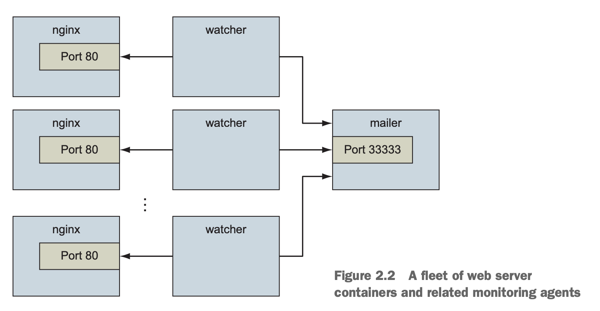
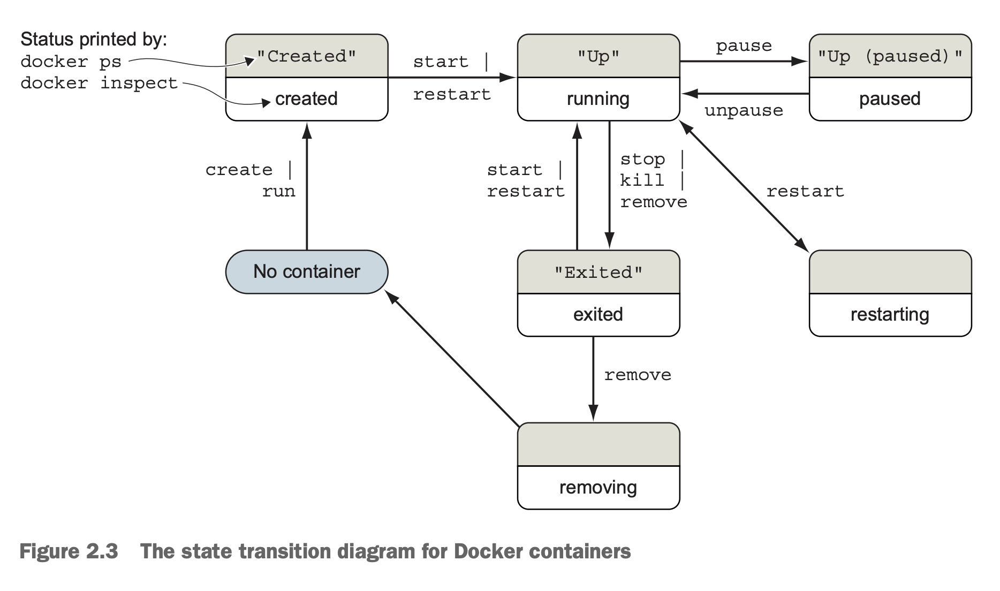
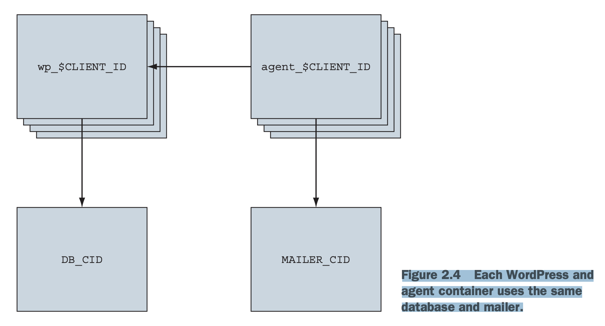

# Part 1: Process isolation and environment-independent computing
- Cách ly là ý tưởng chính trong nhiều mô hình tính toán, cách quản lý resource và theo dõi sử dụng. Nó quan trọng đến mức khó liệt kê hết. Ai học được cách container Linux cách lý chương trình và sử dụng Docker để kiểm soát nó có thể tái sử dụng tốt, tiết kiệm resource và làm hệ thống đơn giản 1 hwon
- Phần khó nhất khi học cách áp dụng container là dịch các nhu cầu của phần mềm mà bạn đang cố gắng cô lập. Các chương trình khác nhau có các yêu cầu khác nhau. Dịch vụ web khác với text editor, package manager, compilers hoặc database. Các container cho mỗi chương trình đó sẽ cần cấu hình khác nhau
- Phần này bao gồm các nguyên tắc cơ bản về cấu hình và vận hành container. Nó mở rộng thành các cấu hình container chi tiết hơn để chứng minh toàn bộ khả năng. Vì lý do đó, chúng tôi khuyên bạn nên cố gắng chống lại sự thôi thúc bỏ qua. Có thể mất thời gian để đi đến câu hỏi cụ thể mà bạn đang nghĩ đến, nhưng chúng tôi tin rằng bạn sẽ có được nhiều khám phá hơn trong suốt quá trình này

# Chapter 2: Running software in containers
- **This chapter covers**
  - Chạy các chương trình terminal tương tác và deamon trong các container
  - Các lệnh & thao tác Docker cơ bản
  - Cô lập các chương trình với nhau và injecting configuration
  - Chạy nhiều chương trình trong 1 container
  - Container bền và vòng đời của container
  - Cleaning up

- Trước khi kết thúc chương này, bạn sẽ hiểu tất cả những điều cơ bản để làm việc với container và cách kiểm soát việc cô lập quy trình cơ bản bằng Docker. Hầu hết ví dụ trong cuốn sách này đều sử dụng phần mềm thực tế. Các ví dụ thực tế sẽ giúp giới thiệu các tính năng của Docker và minh hoạ cách bạn sẽ sử dụng chúng trong các hoạt động hằng ngày. Sử dụng image có sẵn làm giảm thời gian học cho người dùng mới. Nếu bạn có phần mềm muốn chứa trong container và đang vội, thì phần 2 có thể sẽ trả lời nhiều câu hỏi trực tiếp hơn của bạn.
- Trong chương này, bạn sẽ cài đặt 1 server web có tên là NGINX. Web server là chương trình giúp các file và chương trình của trang web có thể truy cập được bằng trình duyệt web qua mạng. Bạn sẽ không xây dựng 1 trang web, nhưng bạn sẽ cài đặt và khởi động máy chủ web với Docker

## 2.1 Controlling containers: Building a website monitor
- Giả sử 1 khách hàng mới bước vào văn phòng của bạn và đưa ra yêu cầu vô lý là xây dựng cho họ 1 tran web mới: Họ muốn 1 trang web được giám sát chặt chẽ. Khách hàng cụ thể này muốn tự vận hành hoạt động của họ, vì vậy họ sẽ muốn giải pháp bạn cung cấp để gửi email cho nhóm của họ khi máy chủ dừng hoạt động. Họ cũng đã nghe về phần mềm máy chủ web phổ biến này có tên là NGINX và yêu cầu cụ thể bạn sử dụng nó. Sau khi đọc về những ưu điểm khi làm việc với Docker, bạn đã quyết định dùng nó trong dự án này. Hình 2.1 hiển thị kiến trúc bạn dự định cho dự án

- Ví dụ này sử dụng 3 container. Cái đầu tiên chạy NGINX; cái thứ 2 sẽ chạy 1 chương trình gọi là *mailer*. Cả 2 đều sẽ chạy như các container tách biệt. *Detached* (Tách biệt) có nghĩa là các container sẽ chạy ở chế độ nền, mà không được gắn vào bất kỳ luồng đầu vào hoặc đầu ra nào (Container chạy ở chế độ nền - background, không hiển thị kết quả trực tiếp trên terminal). Một chương trình thứ 3 có tên là *watcher* sẽ chạy như 1 tác nhân giám sát trong 1 interactive container (Watcher - một script giả định để theo dõi hệ thống. interactive container - container tương tác, có thể nhập lệnh & thấy kết quả trực tiếp trên terminal. Khác với detached, interactive gắn với terminal để bạn điều khiển). Cả tác nhân gửi mail và tác nhân theo dõi đều là các file nhỏ được tạo trong ví dụ này. Trong phần này, bạn sẽ học được cách thực hiện những điều sau:
  - Tạo các detached containers (dùng `-d`) và interactive container (dùng `-it`)
  - Liệt kê các container trên của hệ thống
  - Xem log container
  - Dừng & khởi động lại container
  - Gắn lại thiết bị đầu cuối vào container
  - Tháo ra khỏi container gắn liền
- Không cần chần chừ thêm nữa, chúng ta hãy bắt đầu thực hiện đơn hàng của khách hàng

### 2.1.1 Creating and starting a new container
- Docker gọi tập hợp các file và hướng dẫn cần thiết để chạy 1 chương trình phần mềm là 1 `image`. Khi chúng ta cài đặt phần mềm bằng Docker, thực ra chúng ta đang sử dụng Docker để tải xuống hoặc tạo ra 1 image. Có nhiều cách khác nhau để cài đặt image và một số nguồn image. Image được đề cập chi tiết hơn trong chương 3, nhưng hiện tại bạn có thể coi chúng như những container vận chuyển được sử dụng để vận chuyển hàng hoá vật lý trên khắp thế giới. Docker images chứa mọi thứ mà máy tính cần để chạy phần mềm
- Trong ví dụ này, chúng ta sẽ download 1 image cho NGINX từ Docker Hub. Hãy nhớ rằng Docker Hub là sổ đăng ký công khai do Docker Inc. cung cấp. Image NGINX là thứ mà Docker Inc. gọi là kho lưu trữ đáng tin cậy. Nói chung, người hoặc tổ chức phát hành phần mềm sẽ kiểm soát các `trusted repository` cho phần mềm đó. Chạy lệnh sau sẽ download, cài đặt và khởi động 1 containar chạy NGINX
```
docker run --detach --name web nginx:latest
```
- Khi bạn chạy lệnh này, Docker sẽ cài đặt `nginx:latest` từ repository NGINX được lưu trữ trên Docker Hub (Được đề cập trong chương 3) và chạy phần mềm. Sau khi Docker đã cài đặt và bắt đầu chạy NGINX, một dòng ký tự ngẫu nhiên sẽ xuất hiện trên terminal. Nó sẽ trông giống như thế này:
```
7cb5d2b9a7eab87f07182b5bf58936c9947890995b1b94f412912fa822a9ecb5
```
- Blob ký tự đó là mã định danh duy nhất của container vừa được tạo để chạy NGINX. Mỗi lần bạn chạy `docker run` và tạo 1 container mới, container mới đó sẽ có 1 unique identifier. Người dùng thường ghi lại chuỗi này bằng 1 biến để sử dụng với lệnh khác. Bạn không cần phải làm như vậy cho mục đích của ví dụ này
- Sau khi identifier được hiển thị, có thể có vẻ như không có gì xảy ra. Đó là vì bạn đã sử dụng option `--detach` và khởi động chương trình ở chế độ nền. Điều này có nghĩa là chương trình đã bắt đầu nhưng không được attached vào terminal của bạn. Khởi động NGINX theo cách này là hợp lý vì chúng ta sẽ chạy vài chương trình. Server software thường được chạy trong các containers ngầm vì hiếm khi software phụ thuộc vào 1 attached terminal
- Chạy các detached containers là giải pháp hoàn hảo cho các chương trình chạy ngầm ở backgroud. Loại program đó gọi là `daemon`(Chương trình chạy nền trong hệ điều hành thường có chứ *d* ở cuối - vd *httpd*) hoặc `service`. Daemon thường tương tác với các programs khác hoặc con người thông qua network hoặc 1 số kênh truyền thông khác. Khi bạn khởi chạy 1 daemon hoặc program khác trong 1 container mà bạn muốn chạy ở chế độ nền, hãy nhớ sử dụng flag `--detach` hoặc dạng viết tắt là `-d`
- Một deamon khác mà khách hàng của bạn cần trong ví dụ này là 1 `mailer`. Mailer chờ kết nối từ một người gọi & sau đó gửi email (Vd web app gửi yêu cầu đến mailer để gửi email xác nhận cho người dùng). Lệnh sau sẽ cài đặt và chạy 1 mailer phù hợp cho ví dụ này
```
docker run -d \
 --name mailer \
 dockerinaction/ch2_mailer
 ```
- Lệnh này sử dụng dạng rút gọn của flag --detach để bắt đầu 1 container mới có tên là mailer ở chế độ nền. Tại thời điểm này, bạn đã chạy 2 lệnh và cung cấp 2/3 hệ thống mà khách hàng muốn. Component cuối cùng gọi là `agent`, phù hợp với interactive (tương tác) container

### 2.1.2 Running interactive containers
- Text editor mở trên terminal là 1 ví dụ tuyệt vời về chương trình cần có terminal để hoạt động. Nó lấy dữ liệu đầu vào từ người dùng thông qua bàn phím (có thể là chuột) và hiển thị đầu ra trên terminal. Nó có tính tương tác thông qua các luồng đầu vào và đầu ra. Để chạy các interactive programs trong Docker, bạn phải liên kết các phần của terminal với input hoặc output của 1 container. 
- Để bắt đầu làm việc với interactive containers, hãy chạy lệnh sau:
```
docker run --interactive --tty \
 --link web:web \
 --name web_test \
 busybox:1.29 /bin/sh
```
- Lệnh sử dụng 2 flag trên command: `interactive (hoặc -i)` và `-tty (hoặc -t)`. Đầu tiên, option `-interactive` yêu cầu Docker giữ luồng đầu vào chuẩn (stdin) (luồng dữ liệu mà bạn gửi vào chương trình, thường là từ keyboard) mở cho container (Không đóng luồng này, nghĩa là bạn có thể tiếp tục gửi lệnh hoặc dữ liệu vào container) ngay cả khi không có terminal nào được attach (ngay cả khi không có terminal nào kết nối trực tiếp với container, luồng đầu vào vẫn hoạt động). Thứ 2, option `-tty` yêu cầu Docker phân bổ 1 virtual terminal cho container, cho phép bạn truyền tín hiệu đến container. Đây thường là những gì bạn mong muốn từ 1 interactive command-line program. Bạn thường sử dụng cả 2 cách này khi chạy 1 interactive program như shell trong 1 interactive container. 
- Cũng quan trọng như các interactive flags, khi bạn bắt đầu container này, bạn đã chỉ định chương trình chạy bên trong conainer. Trong trường hợp này, bạn đã chạy 1 shell program có tên là `sh`. Bạn có thể chạy bất kỳ program nào bên trong container
- Lệnh trong ví dụ về container tương tác tạo ra 1 container, khởi động shell UNIX và được liên kết với container đang chạy NGINX. Từ shell này, bạn có thể chạy các lệnh xác minh rằng web server của bạn đang chạy đúng cách
```
wget -O - http://web:80/
```
- Sử dụng 1 program có tên là wget để thực hiện request HTTP đến web server(NGINX server mà bạn đã khởi động trước đó trong 1 container) và sau đó hiển thị nội dung của trang web trên terminal của bạn. Trong số các dòng khác, sẽ có 1 thông báo như "Welcome to NGINX!". Nếu bạn thấy thông báo đó thì mọi thứ đang hoạt động bình thường và bạn có thể tiếp tục và tắt interactive container bằng cách nhập exit. Thao tác này sẽ chấm dứt chương trình shell và dừng container. 
- Có thể tạo 1 interactive container, bắt đầu thủ công 1 quy trình bên trong container đó, sau đó tách biệt terminal của bạn. Bạn có thể thực hiện bằng cách giữ phím Ctrl (hoặc Control) và nhầm phím P rồi nhấn Q. Tính năng này chỉ hoạt động khi bạn sử dụng option `-tty`.
- Để hoàn thiện công việc cho khách hàng của bạn, bạn cần phải bắt đầu 1 agent (1 chương trình nhỏ - tác nhân thực hiện nhiệm vụ cụ thể, ở đây là giám sát). Đây là 1 agent giám sát sẽ kiểm tra web server như bạn đã làm trong ví dụ trước và gửi tin nhắn bằng mailer nếu web server dừng. Lệnh này sẽ khởi động các agent trong 1 interactive container bằng cách sử dụng các dạng flags ngắn
```
docker run -it \
 --name agent \
 --link web:insideweb \
 --link mailer:insidemailer \
 dockerinaction/ch2_agent
 ```
- Khi chạy, container sẽ kiểm tra web container mỗi giây và in ra thông báo như sau:
```
System up.
```
- Bây giờ, bạn đã thấy chức năng của nó, hãy detach terminal của bạn ra khỏi container. Cụ thể khi bạn khởi động container và nó bắt đầu ghi System, hãy giữ Ctrl (hoặc control) rồi nhấn P và Q. Sau khi thực hiện xong, bạn sẽ được trả về shell cho host computer của mình. Không dừng chương trình, nếu không màn hình sẽ dừng kiểm tra web server
- Mặc dù bạn thường sử dụng các container detached hoặc deamon cho phần mềm mà bạn triển khai tới các server trên mạng của mình, nhưng các interactive container hữu ích để chạy phần mềm trên desktop của bạn hoặc làm việc thủ công trên server. Tại thời điểm này, bạn đã khởi động cả 3 ứng dụng trong container mà khách hàng của bạn cần. Trước khi bạn có thể tự tin khẳng định đã hoàn thành, bạn nên kiểm tra hệ thống

### 2.1.3 Listing, stopping, restarting, and viewing output of containers
- Đầu tiên, bạn nên làm là kiểm tra setup hiện tại của mình là kiểm tra xem container nào đang chạy bằng cách sử dụng lệnh `docker ps`
- Chạy lệnh sẽ hiển thị thông tin sau về từng container đang chạy
  - ID container
  - Image được sử dụng
  - Command thực hiện trong container
  - Thời gian kể từ khi container được tạo ra
  - Thời gian container đã chạy
  - Các networks port được container tiếp xúc
  - Container name
- Tại thời điểm này, bạn sẽ có 3 container đang chạy với các tên: web, mailer và agent. Nếu có bất kỳ điều gì bị thiếu nhưng bạn đã làm theo ví dụ cho đến nay, có thể nó đã bị dừng nhầm. Ba lệnh tiếp theo sẽ restart lại từng container bằng cách sử dụng container name. Chọn những mục thích hợp để restart lại các container bị thiếu trong danh sách các container đang chạy
```
docker restart web
docker restart mailer
docker restart agent
```
- Bây giờ, cả 3 container đều đang chạy, bạn cần kiểm tra xem hệ thống có đang hoạt động chính xác không. Cách tốt nhất để thực hiện điều đó là kiểm tra logs của từng container. Bắt đầu với web container
```
docker logs web
```
- Lệnh này sẽ hiển thị 1 bản ghi dài với nhiều dòng chứa chuỗi con này
```
"GET / HTTP/1.0" 200
```
- Điều này có nghĩa là web server đang chạy và agent đang kiểm tra trang web. Mỗi lần agent kiểm tra trang web, một trong những dòng này sẽ được ghi vào log. Lệnh docker logs có thể hữu ích cho những trường hợp này nhưng không nên phụ thuộc hoàn toàn vào nó vì có rủi ro. Bất cứ điều gì mà chương trình ghi vào luồng đầu ra stdout hoặc stderr sẽ được ghi lại trong log. Vấn đề với pattern này là log không bao giờ xoay hoặc cắt bớt theo mặc định, do đó, dữ liệu sẽ được ghi vào log cho 1 container sẽ vẫn tồn tại và tăng lên miễn là container đó tồn tại. Việc lưu trữ log lâu dài như vậy có thể gây rắc rối cho quá trình chạy dài hạn. Một cách tốt hơn để xử lý log bằng cách dùng volumes và sẽ thảo luận trong chương 4. 
- Bạn có thể biết rằng agent đang giám sát web server bằng cách kiểm tra log chỉ dành cho web. Để hoàn thiện, bạn cũng nên kiểm tra log output cho mailer & agent
```
docker logs mailer
docker logs agent
```
- Log của mailer sẽ trông như thế này
```
CH2 Example Mailer has started.
```
- Log của agent phải chứa 1 số dòng giống như dòng bạn đã xem khi bạn khởi động container
```
System up.
```
  - Lệnh docker logs có 1 flag -follow hoặc -f, sẽ hiển thị các bản ghi & sau đó tiếp tục theo dõi & cập nhật màn hình hiển thị với các thay đổi đối với bản ghi khi chúng xảy ra. Khi hoàn tất, hãy nhấn Ctrl-C (Hoặc command C) để ngắt logs command
- Bây giờ, bạn đã xác thực rằng các container đang chạy và các agent có thể truy cập máy chủ web, bạn nên kiểm tra xem các agent có nhận thấy khi container web dừng không. Khi điều đó xảy ra, agent sẽ trigger 1 cuộc gọi đến *mailer* và sự kiện sẽ được ghi lại trong log cho cả agent & mailer. Lệnh docker stop yêu cầu chương trình có PID 1 trong container dừng lại. Sử dụng nó trong các lệnh sau để kiểm tra system:
```
docker stop web
docker logs mailer
```
- Hãy tìm ở cuối mailer log có nội dung như sau
```
Sending email: To: admin@work Message: The service is down!
```
- Dòng đó có nghĩa là agent đã phát hiện thành công rằng NGINX server trong container có tên web đã dừng. Chúc mừng! Khách hàng rất vui & bạn đã xây dựng được hệ thống thực sự đầu tiên của mình với container & Docker
- Học các tính năng cơ bản của Docker là 1 chuyện, nhưng hiểu lý do tại sao chúng lại hữu ích và cách sử dụng chúng để tuỳ chỉnh cô lập (isolation - Mỗi container chạy độc lập, không ảnh hưởng đến nhau - như hệ điều hành riêng) lại là 1 nhiệm vụ hoàn toàn khác

## 2.2 Solved problems and the PID namespace
- Mỗi program đang chạy hoặc quy trình trên máy Linux đều có 1 số duy nhất gọi là identifier (PID).  PID namespace là tập hợp các số duy nhất xác định các quy trình. Linux cung cấp các công cụ để tạo nhiều namespace tên PID. Mỗi namespace có 1 bộ đầy đủ các PID có thể có. Điều này có nghĩa là PID sẽ chứa PID 1,2,3,... của riêng nó.
- Hầu hết các program sẽ không cần truy cập vào các tiếng trình đang chạy khác hoặc có thể liệt kê các tiến trình đang chạy khác trên hệ thống. Và do đó Docker sẽ tạo ra 1 namespace PID mới cho mỗi container theo mặc định. PID namespace của container cô lập các quy trình trong container đó ra khỏi các quy trình trong các container khác. 
- Theo quan điểm của 1 quy trình trong 1 container có namespace riêng, PID 1 (Process ID số 1 - quá trình đầu tiên & quan trọng nhất trong bất kỳ hệ thống Linux nào) có thể là 1 quá trình thuộc hệ thống khởi động (init system) như `runit` hoặc `supervisor`, thay vì process của host. Trong 1 container khác, PID 1 có thể tham chiếu đến 1 shell command như bash. Chạy lệnh sau để xem nó hoạt động
  - Trên máy thật, PID 1 thường là `systemd` hoặc `init` (quản lý tất cả các process khác)
```
docker run -d --name namespaceA \
 busybox:1.29 /bin/sh -c "sleep 30000"
docker run -d --name namespaceB \
 busybox:1.29 /bin/sh -c "nc -l 0.0.0.0 -p 80"

docker exec namespaceA ps // 1
docker exec namespaceB ps // 2
```
- Command 1 sẽ tạo ra danh sách các quy trình tương tự nhau
```
PID USER TIME COMMAND
 1 root 0:00 sleep 30000
 8 root 0:00 ps
```
- Command 2 sẽ tạo ra 1 danh sách quy trình hơi khác
```
PID USER TIME COMMAND
1 root 0:00 nc -l 0.0.0.0 -p 80
9 root 0:00 ps
```
- Trong ví dụ này, bạn sử dụng lệnh docker exec để chạy các tiến trình bổ sung trong 1 container đang chạy. Trong trường hợp này, lệnh bạn sử dụng được gọi là ps, lệnh này sẽ hiển thị tất cả các tiến trình đang chạy và PID của chúng. Từ kết quả đầu ra, bạn có thể thấy rõ ràng rằng mỗi container đều có 1 process với PID 1
- Nếu không có namespace PID, các process chạy bên trong 1 container sẽ chia sẻ cùng 1 namespace ID như các process trên các container trên máy khác hoặc trên server. Một process trong 1 container sẽ có thể xác định những process nào đang chạy trên server. Tệ hơn nữa, các quy trình trong 1 container có thể kiểm soát các quy trình trong 1 container khác. Một quy trình không thể tham chiếu đến bất kỳ quy trình nào bên ngoài namespace của nó sẽ bị hạn chế khả năng thực hiện các cuộc tấn công có mục tiêu
- Giống như hầu hết các tính năng cô lập của Docker, bạn có thể tuỳ chọn tạo các container mà không có namespace PID của riêng chúng. Điều này rất quan trọng nếu bạn đang sử dụng một chương trình để thực hiện tác vụ quản trị hệ thống yêu cầu liệt kê quy trình từ bên trong 1 container. Bạn có thể tự mình thử điều này bằng cách đặt flag -pid trên docker create hoặc docker run và đặt value thành host. Hãy tự mình thử với 1 container chạy BusyBox Linux và lệnh ps Linux
```
docker run --pid host busybox:1.29 ps
```
- Bởi vì tất cả các container đều có namespace PID riêng, chúng không thể thấy thông tin hữu ích khi kiểm tra PID của mình và phụ thuộc nhiều hơn vào cấu hình tĩnh (Khi dùng riêng nghĩa là không có --pid host thì chúng phải phụ thuộc vào cách cấu hình của chính mình - Như PID 1 là *bash* hoặc *nginx*. Với --pid host container phụ thuộc vào host nhiều hơn - vì thấy PID của host làm mất đi tính cô lập). Giả sử 1 container chạy 2 process: 1 server và 1 process monitor. Màn hình đó có thể phụ thuộc chặt chẽ vào PID dự kiến của server và sử dụng nó để monitor (giám sát) & kiểm soát server. Đây là 1 ví dụ về sự độc lập môi trường
- Hãy xem xét ví dụ web-monitoring trước đó. Giả sử bạn không sử dụng Docker và chỉ chạy NGINX trực tiếp trên máy tính của bạn. Bây giờ, giả sử bạn quên rằng bạn đã bắt đầu NGINX cho 1 dự án khác. Khi bạn khởi động lại NGINX, quy trình thứ 2 sẽ không thể truy cập vào được các resource cần thiết vì process đầu tiên đã có chúng. Đây là ví dụ xung đột phần mềm cơ bản. Bạn có thể thấy nó hoạt động bằng cách thử chạy 2 bản sao NGINX trong cùng 1 container
```
docker run -d --name webConflict nginx:latest
docker logs webConflict
docker exec webConflict nginx -g 'daemon off;'
```
- Last command sẽ hiển thị kết quả như thế này
```
2015/03/29 22:04:35 [emerg] 10#0: bind() to 0.0.0.0:80 failed (98:
Address already in use)
nginx: [emerg] bind() to 0.0.0.0:80 failed (98: Address already in use)
...
```
- Process thứ 2 không được khởi động đúng cách và báo cáo rằng địa chỉ cần thiết đã được sử dụng. Được gọi là `port conflict`, đây là sự cố phổ biến trong các hệ thống thực tế trong đó có nhiều quy trình đang chạy trên cùng 1 máy tính hoặc nhiều người cùng đóng góp vào cùng 1 môi trường. Đây là 1 ví dụ tuyệt vời về vấn đề conflict mà Docker đơn giản hoá và giải quyết. Chạy từng cái trong 1 container khác nhau, như thế này:
```
docker run -d --name webA nginx:latest // Bắt đầu phiên bản NGINX đầu tiên

docker logs webA  // Xác minh nó hoạt động, phải trống

docker run -d --name webB nginx:latest // Bắt đầu phiên bản thứ 2

docker logs webB  // Xác minh nó hoạt động, phải trống
```
- Tính độc lập về môi trường, cung cấp sự tự do để cấu hình phần mềm phụ thuộc vào các resource hệ thống khan hiếm mà không cần quan tâm đến các phần mềm cùng vị trí khác có các yêu cầu xung đột. Sau đây là 1 số vấn đề conflict phổ biến
  - 2 chương trình muốn liên kết với cùng 1 network port
  - 2 chương trình sử dụng cùng 1 tên file tạm thời và file locks đang ngăn chặn điều đó
  - 2 chương trình muốn sử dụng các phiên bản khác nhau của 1 thư viện được cài đặt global
  - 2 processes muốn sử dụng cùng 1 PID file
  - Chương trình thứ 2 bạn cài đặt đã sửa đổi biến môi trường mà một chương trình khác sử dụng. Bây giờ chương trình đầu tiên bị hỏng
  - Nhiều process đang chạy cạnh tranh về memory hoặc CPU time
- Tất cả các conflict này phát sinh khi 1 hoặc nhiều chương trình có sự phụ thuộc chung nhưng không thể đồng ý chia sẻ hoặc có nhu cầu khác nhau. Giống như ví dụ port conflict trước đó, Docker giải quyết xung đột phần mềm bằng các công cụ như Linux namespaces, resource limits, filesystem roots và các thành phần network ảo hoá (virtualized network components). Tất cả các công cụ này được sử dụng để cô lập phần mềm bên trong 1 container Docker

## 2.3 Eliminating metaconflicts: Building a website farm
- Trong phần trước, bạn đã thấy Docker giúp bạn tránh xung đột phần mềm với quy trình cô lập như thế nào. Nhưng nếu bạn không cẩn thận, bạn có thể kết thúc bằng việc xây dựng các hệ thống tạo ra metaconflicts hoặc xung đột giữa các container trong Docker layer
- Hãy xem xét 1 ví dụ khác: Một khác hàng đã yêu cầu bạn xây dựng 1 hệ thống mà bạn có thể lưu trữ một số lượng trang web khác nhau cho khách hàng của họ. Họ cũng muốn sử dụng cùng 1 công nghệ giám sát mà bạn đã xây dựng trước đó trong chương này. Mở rộng hệ thống bạn đã xây dựng trước đó sẽ là cách đơn giản nhất để hoàn thành công việc này mà không cần tuỳ chỉnh cấu hình cho NGINX. Trong ví dụ này, bạn sẽ xây dựng 1 hệ thống với 1 số container chạy máy chủ web và 1 số trình theo dõi giám sát cho mỗi web server. Hệ thống sẽ giống như kiến trúc được mô tả trong hình 2.2

- Bản năng đầu tiên của bạn có thể là chỉ cần bắt đầu nhiều vùng chứa web hơn. Nhưng điều đó không đơn giản như vẻ bề ngoài của nó. Việc xác định các container trở nên phức tạp khi số lượng container tăng lên

### 2.3.1 Flexible container identification
- Cách tốt nhất để tìm hiểu lý do tại sao việc chỉ tạo thêm các bản sao của NGINX container mà bạn đã sử dụng trong ví dụ trước là 1 ý tưởng tồi
```
docker run -d --name webid nginx // Tạo 1 container có tên là `webid`
docker run -d --name webid nginx // Tạo 1 container khác có tên là webid
```
- Lệnh thứ 2 sẽ không thành công do conflict
```
FATA[0000] Error response from daemon: Conflict. The name "webid" is
already in use by container 2b5958ba6a00. You have to delete (or rename)
that container to be able to reuse that name.
```
- Sử dụng tên container cố định như web rất hữu ích cho việc thử nghiệm và document, nhưng trong 1 system có nhiều container, việc sử dụng tên cố định như vậy có thể gây xung đột. Theo mặc định, Docker gán 1 tên duy nhất (thân thiện với con người) cho mỗi vùng chứa mà nó tạo ra. Flag `--name` ghi đè lên process đó bằng 1 giá trị đã biết. Nếu có tình huống phát sinh mà tên của 1 conainer cần thay đổi, bạn luôn có thể đổi tên container bằng lệnh `docker rename`
```
docker rename webid webid-old  // Đổi tên container hiện tại thành webid-old
docker run -d --name webid nginx  // Tạo 1 container khác có tên là webid
```
- Đổi tên container có thể giúp giảm bớt xung đột đặt tên 1 lần nhưng không giúp ích nhiều trong việc tránh vấn đề này ngay từ đầu. Ngoài tên, docker còn gán 1 indentifier duy nhất đã đề cập trong ví dụ đầu tiên. Đây là những con số 1024 bit được mã hoá theo hệ thập lục phân và trông giống như thế này:
```
7cb5d2b9a7eab87f07182b5bf58936c9947890995b1b94f412912fa822a9ecb5
```
- Khi các container được khởi động ở chế độ detached, identifier của chúng sẽ được in ra terminal. Bạn có thể sử dụng identifer này thay cho tên container với bất kỳ lệnh nào cần xác định 1 container cụ thể. Ví dụ, bạn có thể sử dụng ID trước đó với lệnh exec hoặc stop
```
docker exec \
7cb5d2b9a7eab87f07182b5bf58936c9947890995b1b94f412912fa822a9ecb5 \
echo hello
docker stop \
7cb5d2b9a7eab87f07182b5bf58936c9947890995b1b94f412912fa822a9ecb5
```
- Xác suất cao về tính năng duy nhất của các ID được tạo ra có nghĩa là không có khả năng xảy ra conflict với ID này. Ở mức độ thấp hơn, cũng không có khả năng xảy ra va chạm giữa 12 ký tự đầu tiên của ID này trên cùng 1 máy tính. Vì trong hầu hết các interface Docker, bạn sẽ thấy ID container bị cắt bớt thành 12 ký tự đầu tiên. Điều này làm cho ID được tạo ra thân thiện hơn với người dùng. Bạn có thể sử dụng chúng ở bất cứ nơi nào cần có container identifier. 2 lệnh trước có thể được viết như thế này:
```
docker exec 7cb5d2b9a7ea ps
docker stop 7cb5d2b9a7ea
```
- Không có ID nào trong số này đặc biệt phù hợp để con người sử dụng. Nhưng chúng hoạt động tốt với các scripts và các kỹ thuật tự động hoá. Docker có 1 số phương tiện để lấy ID của 1 container để có thể tự động hoá. Trong trường hợp này, ID số đầy đủ hoặc bị cắt bớt sẽ được sử dụng
- Cách đầu tiên để lấy ID của 1 container là chỉ cần bắt đầu hoặc tạo 1 container mới và gán kết quả của lệnh cho 1 biến shell
- Như bạn đã thấy trước đó, khi 1 container mới được khởi động ở chế độ detached, ID của container sẽ được ghi vào terminal (stdout). Bạn không thể sử dụng điều này với các interactive container nếu đây là cách duy nhất để có được ID container tại thời điểm này. May mắn thay, bạn có thể sử dụng lệnh khác để tạo container mà không cần khởi động nó. Lệnh `docker create` tương tự như `docker run`, điểm khác biệt chính là container được tạo ở trạng thái đã dừng
```
docker create nginx
```
- Kết quả sẽ là 1 dòng như thế này
```
b26a631e536d3caae348e9fd36e7661254a11511eb2274fb55f9f7c788721b0d
```
- Nếu bạn đang sử dụng Linux command shell như sh hoặc bash, bạn có thể gán kết quả đó cho 1 biến shell và sử dụng lại sau
```
CID=$(docker create nginx:latest)  // Điều này sẽ có hiệu lực trên các shell tuân thủ POSIX
echo $CID
```
- Shell variable tạo ra cơ hội mới cho conflict, nhưng phạm vi conflict đó bị giới hạn trong terminal session hoặc môi trường xử lý hiện tại mà tập lệnh được khởi chạy. Những xung đột đó có thể dễ dàng tránh được vì 1 mục đích sử dụng hoặc chương trình đang quản lý môi trường đó. Vấn đề với cách tiếp cận này là nó sẽ không giúp ích nếu nhiều người dùng hoặc các quy trình tự động cần chia sẻ thông tin đó. Trong trường hợp đó, bạn có thể sử dụng container ID (CID) file
- Cả lệnh `docker run` và `docker create` đều cung cấp 1 flag khác để ghi ID của container mới vào 1 file đã biết
```
docker create --cidfile /tmp/web.cid nginx // Tạo 1 container dừng mới
cat /tmp/web.cid  // Kiểm tra file
```
- Giống như việc sử dụng các biến shell, tính năng này làm tăng khả năng xảy ra conflict. Tên của file CID (được cung cấp sau - cidfile) phải được biết hoặc có cấu trúc đã biết. Giống như cách đặt tên container thủ công, cách tiếp cận này sử dụng các tên đã biết trong global namespace (trên toàn Docker). Tin tốt là Docker sẽ không tạo container mới bằng cách sử dụng tên file CID được cung cấp nếu file đó đã tồn tại. Lệnh sẽ thất bại giống như khi bạn tạo 2 container có cùng tên
- Một lý do để sử dụng file CID thay vì tên là file CID có thể được chia sẻ với các container một cách dễ dàng và cí thể đặt tên linh hoạt. Phương pháp này sử dụng tính năng Docker volumes, được đề cập trong chương 4
  - Một chiến lược để giải quyết conflict đặt tên file CID là phân vùng namespace bằng cách sử dụng các quy ước đường dẫn đã biết hoặc có thể dự đoán được. Ví dụ trường hợp này, bạn có thể sử dụng đường dẫn chứa tất cả các web container trong 1 thư mục đã biết và phân vùng thêm thư mục đó theo ID khác hàng. Điều này sẽ tạo ra đường dẫn như `/containers/web/customer1/web.cid` hoặc `/containers/web/customer8/web.cid`
- Trong những trường hợp khác, bạn có thể sử dụng các lệnh khác như `docker ps` để lấy ID của 1 container. Ví dụ, nếu bạn muốn lấy ID đã cắt bớt của container được tạo gần đây nhất, bạn có thể sử dụng lệnh sau:
```
CID=$(docker ps --latest --quiet) // Hoạt động trên các shell tuân thủ POSIX
echo $CID

CID=$(docker ps -l -q) // Ngắn hơn
echo $CID
```
  - Nếu bạn muốn lấy ID container đầy đủ, bạn có thể sử dụng option `--no-trunc` trên lệnh `docker ps`
- Các trường hợp automation được đề cập trong các tính năng bạn đã thấy cho đến nay. Nhưng mặc dù việc cắt bớt có ích, các container ID này hiếm khi dễ đọc hoặc dễ nhớ. Vì lý do này, Docker cũng tạo ra những tên dễ đọc cho mỗi container
- Docker tự đặt tên cho container, nó dùng công thức: `[tính từ cá nhân]_[họ của nhà tư tưởng nổi tiếng]` - mục đích tạo tên độc đáo, dễ nhớ và tránh trùng lặp. Ví dụ về tên được tạo là `sympathy_swartz, hungry_goodall và splitting_turing`. Những điều này dường như rất phù hợp cho mục đích dễ đọc và dễ nhớ. Khi bạn làm việc trực tiếp với docker tool, bạn luôn có thể sử dụng `docker ps` để tra cứu tên thân thiện với con người
- Việc xác định container có thể phức tạp, nhưng bạn có thể quản lý vấn đề này bằng cách sử dụng các tính năng tạo ID và tên của Docker

### 2.3.2 Container state and dependencies
- Với kiến thức mới này, hệ thống mới có thể trông như thế này:
```
MAILER_CID=$(docker run -d dockerinaction/ch2_mailer) // Đảm bảo mailer từ ví dụ đầu tiên đang chạy
WEB_CID=$(docker create nginx)

AGENT_CID=$(docker create --link $WEB_CID:insideweb \
 --link $MAILER_CID:insidemailer \
 dockerinaction/ch2_agent)
```
- Đoạn code này có thể được sử dụng để tạo 1 tập lệnh mới khởi chạy 1 NGINX và phiên bản agent mới cho mỗi khách hàng của bạn. Bạn có thể sử dụng `docker ps` để xem chúng đã được tạo ra chưa
```
docker ps
```
- Lý do cả NGINX và agent đều không được đưa vào đầu ra có liên quan đến trạng thái container. Các container Docker sẽ ở 1 trong các trạng thái được hiển thị trong hình 2.3. Các lệnh quản lý Docker container để di chuyển giữa các trạng thái sẽ chú thích từng lần chuyển đổi

- Không có container mới nào mà bạn bắt đầu xuất hiện trong danh sách container vì docker ps chỉ hiển thị các container đang chạy theo mặc định. Các container đó được tạo cụ thể bằng docker create và không bao giờ được khởi động (trạng thái đã tạo). Để xem tất cả các container (bao gồm cả các container ở trạng thái đã tạo), hãy sử dụng option -a
```
docker ps -a
```
- Status của vùng chứa mới phải là "Created". Lệnh `docker ps` hiển thị status container bằng cách sử dụng các tên "friendly" được hiển thị màu xám trong hình 2.3. Lệnh `docker inspect` sử dụng các tên được hiển thị ở nửa dưới của mỗi status (Ví dụ: created). Các status *restarting, removing và dead* (không minh hoạ) là nội bộ của Docker và được sử dụng để theo dõi các chuyển đổi giữa các trạng thái hiển thị trong `docker ps`
- Bây giờ bạn đã xác minh rằng cả 2 container đã được tạo, bạn cần khởi động chúng. Để thực hiện điều đó, bạn có thể sử dụng lệnh `docker start`
```
docker start $AGENT_CID
docker start $WEB_CID
```
- Chạy những lệnh đó sẽ dẫn đến lỗi. Các container cần được khởi động theo thứ tự ngược lại với chuỗi phụ thuộc vào chúng. Vì bạn đã cố gắng khởi động contaner agent trước container web nên Docker đã báo cáo 1 thông báo như thế này:
```
Error response from daemon: Cannot start container
03e65e3c6ee34e714665a8dc4e33fb19257d11402b151380ed4c0a5e38779d0a: Cannot
link to a non running container: /clever_wright AS /modest_hopper/insideweb
FATA[0000] Error: failed to start one or more containers
```
- Trong ví dụ này, container agent phụ thuộc vào container web. Trước tiên, bạn cần khởi động container web:
```
docker start $WEB_CID
docker start $AGENT_CID
```
- Điều này có lý khi bạn xem xét cơ chế hoạt động. Cơ chế liên kết sẽ đưa địa chỉ IP vào các dependent container và các container không chạy sẽ không có địa chỉ IP. Nếu bạn đã cố gắng khởi động 1 container có sự phụ thuộc vào 1 container không chạy, Docker sẽ không có địa chỉ IP để inject. Trong chương 5, bạn sẽ học cách kết nối các container với các bridge network do người dùng xác định để tránh vấn đề phụ thuộc cụ thể này. Điểm mấu chốt ở đây là Docker sẽ cố gắng giải quyết các dependencies của container trước khi tạo hoặc khởi động container để tránh lỗi thời gian chạy ứng dụng 

```md
### The legacy of container network linking
- Bạn có thể nhận thấy rằng tài liệu Docker mô tả liên kết network là 1 tính năng cũ. Network là cách kết nối các container sớm và phổ biến. Các liên kết tạo ra các kết nối network đơn hướng từ 1 container đến các container khác trên cùng 1 host. Các phần quan trọng của hệ sinh thái container yêu cầu kết nối song phương hoàn toàn ngang hàng giữa các container. Docker cung cấp điều này với các network do người dùng xác định được mô tả trong chương 5. Các network này cũng có thể mở rộng trên một cụm server như được mô tả trong chương 13. Network links và network do người dùng xác định không tương đương nhau, nhưng Docker khuyên bạn nên di chuyển sang network do người dùng xác định. 
- Không rõ tính năng container network linking có bao giờ bị xoá hay không. Nhiều công cụ hữu ích và mô hình giao tiếp 1 chiều phụ thuộc vào linking, như được minh hoạ bằng các container được sử dụng để kiểm tra và theo dõi các web component và mailer trong phần này
```
- Cho dù bạn đang sử dụng `docker run` hay `docker create`, các container kết quả cần phải được khởi động theo thứ tự ngược lại với phụ thuộc của chúng (**thứ tự mà các container cần nhau để hoạt động. Ví dụ container A - webserver phụ thuộc vào container B - database thì B phải chạy trước A**). Điều này có nghĩa là không thể xây dựng các dependencies tuần hoàn bằng cách sử dụng các mối quan hệ Docker container (**Ví dụ như A cần B để chạy và B cũng cần A để chạy**).
- Tại thời điểm này, bạn có thể kết hợp mọi thứ lại thành 1 tập lệnh ngắn gọn trông như thế này
```
MAILER_CID=$(docker run -d dockerinaction/ch2_mailer)

WEB_CID=$(docker run -d nginx)

AGENT_CID=$(docker run -d \
--link $WEB_CID:insideweb \
--link $MAILER_CID:insidemailer \
dockerinaction/ch2_agent)
```
- Bây giờ bạn có thể tự tin rằng tập lệnh này có thể chạy mà không có ngoại lệ mỗi khi máy khách của bạn cần cung cấp 1 trang web mới. Khách hàng của bạn đã quay lại và cảm ơn bạn vì công việc monitoring và web mà bạn đã hoàn thành cho đến nay, nhưng mọi thứ đã thay đổi
- Họ quyết định tập chung vào việc xây dựng trang web của mình bằng WordPress (một chương trình quản lý nội dung & viết blog nguồn mở phổ biến). May mắn thay, WordPress được xuất bản thông qua Docker Hub trong 1 repository có tên là `wordpress`. Tất cả những gì bạn cần cung cấp là 1 tập lệnh để cung cấp 1 trang web Wordpress mới có cùng các tính năng monitoring và alerting mà bạn đã cung cấp
- Một điều thú vị về các hệ thống quản lý nội dung và các hệ thống có trạng thái khác là các dữ liệu mà chúng làm việc cùng làm cho mỗi chương trình đang chạy trở nên chuyên biệt. Blog WordPress của Adam khác với blog WordPress của Betty, ngay cả khi họ đang chạy cùng 1 phần mềm. Chỉ có nội dung là khác nhau. Ngay cả khi nội dung giống nhau, chúng vẫn khác nhau vì chúng chạy trên các trang web khác nhau
- Nếu bạn xây dựng các hệ thống hoặc phần mềm biết quá nhiều về môi trường của chúng - ví dụ, địa chỉ hoặc vị trí cố định của các service phụ thuộc - thì rất khó để thay đổi môi trường đó hoặc tái sử dụng phần mềm. Bạn cần cung cấp 1 hệ thống giảm thiểu sự phụ thuộc vào môi trường trước khi hợp đồng hoàn tất (Khách hàng mong muốn hệ thống dễ mở rộng, dễ dùng ở nhiều nơi, không bi "gắn chế" vào 1 cấu hình)

## 2.4 Building environment-agnostic systems
- Phần lớn các công việc liên quan đến việc cài đặt phần mềm hoặc bảo trì 1 nhóm máy tính nằm ở việc xử lý các đặc thù của môi trường máy tính (**Mỗi máy có thể khác nhau, gây khó khăn khi cài đặt & bảo trì**). Các đặc thù này xuất hiện dưới dạng các phụ thuộc có phạm vi toàn cần (Ví dụ: vị trí host filesystem cố định) (**Nếu phần mềm yêu cầu file config phải ở /etc/myapp/config, nhưng máy khác không có thư mục đó, cài đặt sẽ thất bại**), kiến trúc triển khai được mã hoá cứng (kiểm tra môi trường trong mã hoặc cấu hình) hoặc vị trí dữ liệu (dữ liệu được lưu trữ trên 1 máy tính cụ thể bên ngoài kiến trúc triển khai) (**Ví dụ script kiểm tra if [ $OS = "Ubuntu"] - nếu chạy trên CentOS, nó sẽ lỗi**). Biết được điều này, nếu mục tiêu của bạn là xây dựng các hệ thống ít cần bảo trì, bạn nên cố gắng giảm thiểu những thứ trên (**Hệ thống linh hoạt, không phụ thuộc vào đặc thù của từng máy, sẽ dễ bảo trì hơn**)
- Docker có 3 tính năng cụ thể giúp xây dựng hệ thống không phụ thuộc vào môi trường
  - Read-only filesystems
  - Environment variable injection
  - Volumes
- Làm việc với volumes là 1 chủ đề lớn và là chủ đề của chương 4. Để tìm hiểu 2 tính năng đầu tiên, hãy xem xét thay đổi yêu cầu đối với tình huống ví dụ được sử dụng trong phần còn lại của chương này: Wordpress sử dụng 1 database program có tên là MySql để lưu trữ hầu hết các dữ liệu, do đó, bạn nên cung cấp cho container chạy WordPress 1 filesystem chỉ đọc để đảm bảo dữ liệu chỉ được ghi vào CSDL (**Vì dữ liệu lưu trong Mysql, để tránh không ghi dữ liệu linh tinh vào container, nên để là read-only filesystem**)

### 2.4.1 Read-only filesystems
- Sử dụng read-only filesystem thực hiện được 2 điều tích cực. Đầu tiên, bạn có thể tin tưởng rằng, container sẽ không bị chuyên biệt hoá do những thay đổi đối với các file mà nó chứa (**Đối với read-only, không ai có thể sửa đổi file, giúp container luôn trong trạng thái nguyên bản như ban đầu**). Thứ 2 bạn sẽ tự tin hơn rằng kẻ tấn công không thể xâm phạm các file trong container
- Để bắt đầu làm việc trên hệ thống của khách hàng, hãy tạo & khởi động 1 container từ image WP bằng cách sử dụng flag `--read-only`:
```
docker run -d --name wp --read-only \
wordpress:5.0.0-php7.2-apache
```
- Khi hoàn tất, hãy kiểm tra xem container có đang chạy không. Bạn có thể thực hiện việc này bằng bất kỳ phương pháp nào đã được giới thiệu trước đó hoặc có thể kiểm tra trực tiếp metadata của container
- Lệnh sau sẽ in ra true nếu container có tên wp đang chạy và false nếu không
```
docker inspect --format "{{.State.Running}}" wp
```
- Lệnh `docker inspect` sẽ hiển thị tất cả metadata (1 JSON document) mà docker duy trì cho 1 container (**Metadata bao gồm các thông tin: ID, status, port, volume, network,...**). Tuỳ chọn định dạng chuyển đổi metadata đó và trong trường hợp này, nó lọc mọi thứ ngoại trừ trường cho biết trạng thái đang chạy của container(**Thay vì hiển thị JSON dài dòng, nó chỉ lấy giá trị của trường trạng thái State.running**). Lệnh này chỉ đơn giản đưa ra kết quả sai
- Trong trường hợp này, container không chạy. Để xác định lý do, hãy kiểm tra logs của container:
```
docker logs wp
```
- Lệnh đó sẽ cho ra kết quả tương tự như sau:
```
WordPress not found in /var/www/html - copying now...
Complete! WordPress has been successfully copied to /var/www/html
... skip output ...
Wed Dec 12 15:17:36 2018 (1): Fatal Error Unable to create lock file: ↵
Bad file descriptor (9)
```
- Khi chạy WP với read-only filesystem, quy trình Apache web server reports rằng nó không thể tạo file khoá. Thật không may, nó không báo cáo vị trí của các file mà nó đang cố gắng tạo ra. Nếu chúng ta có các vị trí, chúng ta có thể tạo ra các ngoại lệ cho chúng. Hãy chạy 1 container WP với hệ thống filesystem có thể ghi để Apache có thể tự do ghi ở bất kỳ đâu mà nó muốn (**Sau khi biết vị trí, có thể tạo ngoại lệ và bật lại chế độ read-only**)
```
docker run -d --name wp_writable wordpress:5.0.0-php7.2-apache
```
- Bây giờ, chúng ta hãy kiểm tra xem Apache đã thay đổi hệ thống file của container ở đâu bằng lệnh `docker diff`
```
docker container diff wp_writable
C /run
C /run/apache2
A /run/apache2/apache2.pid
```
- Chúng tôi sẽ giải thích lệnh diff và cách docker biết những thay đổi trên filesystem chi tiết hơn trong chương 3. Hiện tại, bạn chỉ cần biết rằng đầu ra cho Apache đã tạo thư mục `/run/apache2` và thêm file `apache2.pid` bên trong folder đó.
- Vì đây là 1 phần dự kiến của hoạt động ứng dụng bình thường, chúng tôi sẽ tạo ra 1 exception cho read-only filesystem. Chúng tôi cho phép container ghi vào `/run/apache2` bằng cách sử dụng ổ đĩa có thể ghi được gắn kết từ server. Chúng tôi sẽ cung cấp 1 filesystem tạm thời trong bộ nhớ cho container tại `/tmp` vì Apache cũng yêu cầu 1 thư mục tạm thời có thể ghi
```
docker run -d --name wp2 \
 --read-only \  // Làm cho root filesystem của container chỉ đọc
 -v /run/apache2/ \  // Gắn 1 thư mục có thể ghi từ máy chủ
 --tmpfs /tmp \  // Cung cấp cho container 1 hệ thống filesystem trong bộ nhớ
 wordpress:5.0.0-php7.2-apache
```
- Lệnh đó sẽ ghi lại các thông báo thành công trông như thế này
```
docker logs wp2
WordPress not found in /var/www/html - copying now...
Complete! WordPress has been successfully copied to /var/www/html
... skip output ...
[Wed Dec 12 16:25:40.776359 2018] [mpm_prefork:notice] [pid 1] ↵
AH00163: Apache/2.4.25 (Debian) PHP/7.2.13 configured -- ↵
resuming normal operations
[Wed Dec 12 16:25:40.776517 2018] [core:notice] [pid 1] ↵
AH00094: Command line: 'apache2 -D FOREGROUND'
```
- WP cũng phụ thuộc vào mysql database. Database là 1 chương trình lưu trữ dữ liệu theo cách nó có thể truy xuất và tìm kiếm được sau này. Tin tốt là bạn có thể cài đặt MySQL bằng cách sử dụng Docker, giống như WP
```
docker run -d --name wpdb \
 -e MYSQL_ROOT_PASSWORD=ch2demo \
 mysql:5.7
```
- Sau khi bắt đầu, hãy tạo 1 container WP khác được liên kết với container database mới này:
```
docker run -d --name wp3 \  // Sử dụng tên duy nhất
 --link wpdb:mysql \  // Tạo liên kết đến database
 -p 8000:80 \   // Chuyển hướng lưu lượng từ cổng server 8000 đến cổng container 80
 --read-only \
 -v /run/apache2/ \
 --tmpfs /tmp \
 wordpress:5.0.0-php7.2-apache
```
- Kiểm tra 1 lần nữa xem WP chạy có đúng không
```
docker inspect --format "{{.State.Running}}" wp3
```
- Đầu ra bây giờ phải là true. Nếu bạn muốn sử dụng cài đặt WP mới của mình, bạn có thể trỏ trình duyệt tới http://127.0.0.1:8000
- Phiên bản cập nhật của tập lệnh mà bạn đang thực hiện sẽ trông như thế này
```
#!/bin/sh

DB_CID=$(docker create -e MYSQL_ROOT_PASSWORD=ch2demo mysql:5.7)

docker start $DB_CID

MAILER_CID=$(docker create dockerinaction/ch2_mailer)

docker start $MAILER_CID

WP_CID=$(docker create --link $DB_CID:mysql -p 80 \
--read-only -v /run/apache2/ --tmpfs /tmp \
wordpress:5.0.0-php7.2-apache)

docker start $WP_CID

AGENT_CID=$(docker create --link $WP_CID:insideweb \
--link $MAILER_CID:insidemailer \
dockerinaction/ch2_agent)

docker start $AGENT_CID
```
- Xin chúc mừng, đến thời điểm này, bạn đã có 1 container WP đang chạy. Bằng cách sử dụng `read-only filesystem` và liên kết WP với 1 container khác đang chạy database, bạn có thể chắc chắn rằng container đang chạy WP image sẽ không bao giờ thay đổi. Điều này có nghĩa là nếu có bất kỳ sự cố nào xảy ra đối với máy tính chạy blog WP của khách hàng, bạn sẽ có thể khởi động 1 bản sao khác của container đó ở nơi khác mà không gặp vấn đề gì (**Dữ liệu luôn được lưu trong DB, đảm bảo container WP có thể tái sử dụng dễ dàng, nếu gặp sự cố, chạy lại WP container mà không lo mất dữ liệu**)
- Nhưng thiết kế này có 2 vấn đề. Đầu tiên, CSDL đang chạy trong 1 container trên cùng 1 máy tính với WP container. Thứ 2, WP sử dụng 1 số giá trị mặc định cho các thiết lập quan trọng như database name, user, password quản trị, database salt,...
- Để giải quyết vấn đề này, bạn có thể tạo nhiều phiên bản phần mềm WP, mỗi phiên bản có cấu hình đặc biệt cho client. Làm như vậy sẽ biến tập lệnh cung cấp đơn giản của bạn thành 1 con quái vật tạo ra image và ghi file(Khiến script triển khai trở nên phức tạp vì phải tạo ra nhiều image khác nhau, chỉnh sửa file cấu hình cho từng khách). Một cách tốt hơn để đưa cấu hình đó vào là thông qua việc sử dụng các biến môi trường (**Sử dụng chung 1 image & truyền thông tin cấu hình qua biến môi trường khi chạy container**)

### 2.4.2 Environment variable injection
- Biến môi trường là cặp key-value được cung cấp cho các chương trình thông qua ngữ cảnh thực thi của chúng. Chúng cho phép bạn thay đổi cấu hình của chương trình mà không cần sửa đổi bất kỳ file nào hoặc thay đổi lệnh được sử dụng để khởi động chương trình.
- Docker sử dụng các environment để truyền đạt thông tin về các container phụ thuộc, tên server của container và các thông tin thuận tiện khác cho các chương trình chạy trong container(**Khi 1 container phụ thuộc vào container khác, Docker có thể sử dụng environment để truyền thông tin - vd container WP cần kết nối đến MySQL, Docker có thể đặt environment WP_DB_HOST trỏ đến MySQL container**). Docker cũng cung cấp 1 cơ chế cho phép người dùng đưa các biến môi trường vào 1 container mới. Các chương trình biết mong đợi thông tin quan trọng thông qua các biến môi trường có thể được cấu hình tại thời điểm tạo container(**Giúp ứng dụng chạy tốt trong môi trường Docker vì các thông tin quan trọng có thể được truyền vào lúc khởi tạo container**). May mắn cho bạn và khách hàng của bạn, WP là 1 chương trình như vậy
- Trước khi đi sâu vào chi tiết WP, hãy thử tự mình inject vào xem các environment. Lệnh UNIX env hiển thị tất cả các environment trong bối cảnh thực thi hiện tại (terminal của bạn). Để xem quá trình environment variable injection diễn ra như thế nào, hãy sử dụng lệnh sau:
```
docker run --env MY_ENVIRONMENT_VAR="this is a test" \  // Inject 1 environment
 busybox:1.29 \
 env   // Thực hiện env bên trong container
```
- `--env` flag hay viết tắt là `-e` có thể được sử dụng để đưa bất kỳ environment variable nào vào. Nếu biến đã được thiết lập bởi image hoặc Docker, giá trị sẽ bị ghi đè. Theo cách này, các chương trình chạy bên trong container có thể dựa vào các biến luôn được thiết lập. WP quan sát các environment sau:
```
WORDPRESS_DB_HOST
 WORDPRESS_DB_USER
 WORDPRESS_DB_PASSWORD
 WORDPRESS_DB_NAME
 WORDPRESS_AUTH_KEY
 WORDPRESS_SECURE_AUTH_KEY
 WORDPRESS_LOGGED_IN_KEY
 WORDPRESS_NONCE_KEY
 WORDPRESS_AUTH_SALT
 WORDPRESS_SECURE_AUTH_SALT
 WORDPRESS_LOGGED_IN_SALT
 WORDPRESS_NONCE_SALT
```
  - Ví dụ này bỏ qua các biến KEY và SALT, nhưng bất kỳ product system thực tế nào cũng phải thiết lập giá trị này
- Để bắt đầu, bạn nên giải quyết vấn đề database đang chạy trong 1 container trên cùng 1 máy tính với WP container. Thay vì sử dụng liên kết để đáp ứng sự phụ thuộc vào database của WP, hãy chèn giá trị cho biến WORDPRESS_DB_HOST
```
docker create --env WORDPRESS_DB_HOST=<my database hostname> \
wordpress: 5.0.0-php7.2-apache
```
- Ví dụ này sẽ tạo (không khởi động) một WP container sẽ cố gắng kết nối với DB tại bất kỳ địa chỉ nào bạn chỉ định tại `<my database hostname>`. Vì remote DB có thể không sử dụng tên người dùng hoặc mật khẩu mặc định, bạn cũng sẽ phải chèn các giá trị cho các thiết lập đó. Giả sử quản trị viên DB thích mèo và không sử dụng mật khẩu mạnh
```
docker create \
--env WORDPRESS_DB_HOST=mysql \
--env WORDPRESS_DB_USER=site_admin \
--env WORDPRESS_DB_PASSWORD=MeowMix42 \
wordpress:5.0.0-php7.2-apache
```
- Sử dụng phương pháp environment variable injection theo cách này sẽ giúp bạn tách biệt các mối liên hệ vật lý giữa container WP và container MySQL. Ngay cả khi bạn muốn lưu trữ DB và các trang web WP của khách hàng trên cùng 1 máy, bạn vẫn cần phải khắc phục sự cố thứ 2 đã đề cập trước đó. Tất cả các trang web đều sử dụng cùng 1 tên DB mặc định, điều này có nghĩa là các máy khách khác nhau sẽ chia sẻ 1 DB duy nhất. Bạn sẽ cần sử dụng đến chức năng environment variable injection để đặt tên DB cho từng trang web độc lập bằng cách chỉ định tên biến WORDPRESS_DB_NAME
```
docker create --link wpdb:mysql \
 -e WORDPRESS_DB_NAME=client_a_wp \  // For client a\A
 wordpress:5.0.0-php7.2-apache

docker create --link wpdb:mysql \
 -e WORDPRESS_DB_NAME=client_b_wp \  // For client B
 wordpress:5.0.0-php7.2-apache
```
- Bây giờ bạn đã hiểu cách đưa cấu hình vào ứng dụng WP và kết nối nó với các quy trình cộng tác, hãy điều chỉnh tập lệnh cung cấp. Trước tiên, hãy khởi động các container DB và mailer sẽ được chia sẻ bởi khách hàng của chúng ta và lưu trữ ID container trong các enviroment variable
```
export DB_CID=$(docker run -d -e MYSQL_ROOT_PASSWORD=ch2demo mysql:5.7)
export MAILER_CID=$(docker run -d dockerinaction/ch2_mailer)
```
- Bây giờ, hãy cập nhật tập lệnh cung cấp trang web của máy khách để đọc ID container chứa DB, container ID và CLIENT_ID mới từ các environment
```
#!/bin/sh

if [ ! -n "$CLIENT_ID" ]; then  // Giả sử biến $CLIENT_ID được đặt làm đầu vào cho script
 echo "Client ID not set"
 exit 1

fi

WP_CID=$(docker create \
 --link $DB_CID:mysql \  // Tạo liên kết bằng DB_CID
 --name wp_$CLIENT_ID \
 -p 80 \
 --read-only -v /run/apache2/ --tmpfs /tmp \
 -e WORDPRESS_DB_NAME=$CLIENT_ID \
 --read-only wordpress:5.0.0-php7.2-apache)

docker start $WP_CID

AGENT_CID=$(docker create \
 --name agent_$CLIENT_ID \
 --link $WP_CID:insideweb \
 --link $MAILER_CID:insidemailer \
 dockerinaction/ch2_agent)

docker start $AGENT_CID
```
- Nếu bạn lưu script này vào file có tên `start-wp-for-client.sh`, để chạy script cho khách hàng `dockerinaction`, dùng lệnh:
```
CLIENT_ID=dockerinaction ./start-wp-multiple-clients.sh
```
- Script mới này sẽ chạy một phiên bản WP và monitoring agent cho mỗi khách hàng và kết nối các container đó với nhau cũng như 1 mailer program duy nhất và  MySQL DB. Các WP container có thể bị huỷ, khởi động lại & nâng cấp mà không lo mất dữ liệu. Hình 2.4 sẽ cho chúng ta thấy kiến trúc này

- Khách hàng phải hài lòng với những gì được giao. Nhưng có 1 điều có thể sẽ khiến bạn phải bận tâm. Trong thử nghiệm trước đó, bạn thấy rằng monitoring agent đã thông báo chính xác cho mailer khi trang web không khả dụng, nhưng việc khởi động lại trang web và agent lại yêu cầu phải thực hiện thủ công. Sẽ tốt hơn nếu hệ thống cố gắng tự động chạy lại khi phát hiện lỗi. Docker cung cấp các chính sách restart để giúp giải quyết các vấn đề đó, nhưng bạn có thể muốn thứ gì đó mạnh mẽ hơn

## 2.5 Building durable containers
- Phần mềm có thể bị lỗi trong những điều kiện hiếm hoi mang tính tạm thời. Mặc dù điều quan trọng là phải nhận thức được khi những điều kiện này phát sinh, nhưng thường thì việc khôi phục dịch vụ càng nhanh càng tốt cũng quan trọng không kém. Hệ thống giám sát mà bạn xây dựng chương này là 1 khởi đầu tốt giúp chủ sở hữu hệ thống nhận biết các vấn đề với hệ thống, nhưng nó không giúp khôi phục dịch vụ
- Khi tất cả các process trong 1 container đã thoát, container đó sẽ chuyển sang trạng thái đã thoát. Hãy nhớ rằng, 1 container Docker có thể ở 1 trong 6 trạng thái sau
  - Created
  - Running
  - Restarting
  - Paused
  - Removing
  - Exited (Cũng được sử dụng nếu container chưa bao giờ được khởi động)
- Một chiến lược cơ bản để phục hồi sau các lỗi tạm thời là tự restart lại 1 quy trình khi nó thoát hoặc lỗi. Docker cung cấp 1 số option để monitoring và restart container

### 2.5.1 Automatically restarting containers
- Docker cung cấp chức năng này với chính sách restart. Khi sử dụng flag `--restart` tại thời điểm tạo container, bạn có thể yêu cầu Docker thực hiện bất kỳ thao tác nào sau đây:
  - Không bao giờ khởi động lại (Default)
  - Cố gắng khởi động lại khi phát hiện lỗi
  - Cố gắng khởi động lại trong 1 khoảng thời gian nhất định trước khi phát hiện ra lỗi
  - Luôn khởi động lại container bất kể điều kiện
- Docker không phải lúc nào cũng cố gắng khởi động ngay lập tức 1 container. Nếu vậy, nó sẽ gây ra nhiều vấn đề hơn là giải quyết được. Hãy tưởng tượng 1 container chỉ có chức năng in thời gian & thoát. Nếu container đó được cấu hình để luôn restart lại ngay lập tức thì hệ thống đó sẽ không làm gì ngoài việc khởi động lại container đó. Thay vào đó, Docker sẽ sử dụng chiến lược lùi theo cấp số nhân để tính thời gian cho các lần khởi động
- Chiến lược lùi (backoff strategy) xác định khoảng thời gian cần trôi qua giữa các lần restart lại liên tiếp. 1 backoff strategy theo cấp số nhân sẽ làm tăng gấp đôi thời gian chờ đợi trước đó cho mỗi lần thử tiếp theo. Ví dụ, nếu lần đầu tiên container cần được restart, Docker sẽ đợi 1s, thì ở lần thứ 2 nó sẽ đợi 2s, 4s ở lần thứ 3 và 8s ở lần thứ 4,.... Các backoff strategy theo cấp số nhân với thời gian chờ ban đầu thấp là 1 kỹ thuật khôi phục dịch vụ phổ biến. Bạn có thể thấy, Docker tự áp dụng chiến lược này bằng cách xây dựng 1 container luôn restart và chỉ in ra thời gian
```
docker run -d --name backoff-detector --restart always busybox:1.29 date
```
- Sau đó, sau vài giây, hãy sử dụng tính năng theo dõi logs để xem nó tắt đi và restart lại
```
docker logs -f backoff-detector
```
- Log sẽ hiển thị tất cả các lần restart lại và đợi đến lần restart tiếp theo, in thời gian hiện tại, sau đó thoát. Việc thêm flag duy nhất này vào monitoring agent vào 1 WP container mà bạn đang làm việc sẽ giải quyết vấn đề được khôi phục
- Lý do duy nhất khiến bạn có thể không muốn áp dụng trực tiếp điều này là trong thời gian chờ, container không chạy. Các container đang chờ restart đang ở trạng thái restart. Để chứng minh, hãy thử chạy với 1 quy trình khác trong container backoff-detector
```
docker exec backoff-detector echo Just a Test
```
- Chạy lệnh đó sẽ nhận được thông báo lỗi
```
Container <ID> is restarting, wait until the container is running
```
- Điều đó có nghĩa là bạn không thể làm bất kỳ điều gì yêu cầu container phải ở trạng thái đang chạy, chẳng hạn như thực hiện các lệnh bổ sung trong container. Điều đó có thể là vấn đề nếu bạn cần chạy chương trình chuẩn đoán trong 1 container bị hỏng. Một chiến lược an toàn hơn là sử dụng các container khởi động lightweight init system.

### 2.5.2 Using PID 1 and init systems
- `init system` là 1 chương trình được sử dụng để khởi chạy và duy trì trạng thái của các chương trình khác. Bất kỳ quy trình nào có PID 1 đều được xử lý như 1 quy trình init bởi Linux kernel (`Trong Linux, PID 1 là "ông tổ" của mọi process - Mọi process đều bắt nguồn từ nó`) (ngay cả khi về mặt kỹ thuật nó không phải là init system - `PID 1 có thể không phải phần mềm chuyên dụng như **systemd** hay **runit**, mà chỉ là 1 chương trình bình thường như bash, nginx - Ví dụ chạy **docker run -it ubuntu bash** thì bash trở thành PID 1, dù nó không phải init system. Nếu PID 1 dừng như gõ exit trong bash, container cũng dừng vì kernel coi nó là init`). Ngoài các chức năng quan trọng khác, init system start các process khác, khởi động lại chúng trong trường hợp chúng bị lỗi
- Một số hệ thống init như vậy có thể được sử dụng bên trong 1 container(`Container không bắt buộc sử dụng init system, nhưng nếu cần chạy nhiều process hoặc quản lý chúng, init system rất hữu ích`). Phổ biến nhất bao gồm runit, Yelp/dump-init, tini, supervisord và tianon/gosu. Bây giờ, hãy xem 1 container sử dụng `supervisord`.
- Docker cung cấp 1 image chứa toàn bộ LAPP(Linux, Apache, MySQL, PHP) bên trong 1 container duy nhất. Các container được tạo theo cách này sử dụng supervisord để đảm bảo rằng tất cả các quy trình liên quan đều được tiếp tục chạy. Bắt đầu với 1 example container:
```
docker run -d -p 80:80 --name lamp-test tutum/lamp
```
- Bạn có thể xem những process nào đang chạy bên trong container này bằng cách sử dụng lệnh docker top
```
docker top lamp-test
```
- Subcommand trên cùng sẽ hiển thị PID server cho từng process trong container. Bạn sẽ thấy supervisord, mysql và apache được bao gồm trong danh sách các programs đang chạy. Bây giờ, container đang chạy, bạn có thể kiểm tra chức năng khởi động lại Supervisord bằng cách dừng thủ công 1 trong các process trong container. Vấn đề là để huỷ 1 process bên trong 1 container từ bên trong container đó, bạn cần biết PID trong namespace PID của container. Để có được danh sách đó, hãy chạy lệnh `exec` sau:
```
docker exec lamp-test ps
```
- Danh sách process được tạo sẽ liệt kê Apache2 trong cột CMD
```
PID TTY TIME CMD
 1 ? 00:00:00 supervisord
433 ? 00:00:00 mysqld_safe
835 ? 00:00:00 apache2
842 ? 00:00:00 ps
```
- Các giá trị trong cột PID sẽ khác nhau khi bạn chạy command. Tìm PID trên hàng cho apache2 và sau đó chèn PID đó cho <PID> trong lệnh sau
```
docker exec lamp-test kill <PID>
```
- Chạy command này sẽ chạy program Linux kill bên trong container lamp-test và yêu cầu process apache2 tắt
