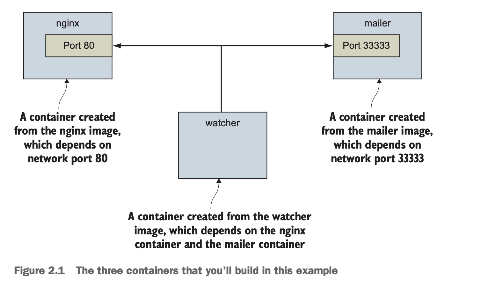

# Part 1: Process isolation and environment-independent computing
- Cách ly là ý tưởng chính trong nhiều mô hình tính toán, cách quản lý resource và theo dõi sử dụng. Nó quan trọng đến mức khó liệt kê hết. Ai học được cách container Linux cách lý chương trình và sử dụng Docker để kiểm soát nó có thể tái sử dụng tốt, tiết kiệm resource và làm hệ thống đơn giản 1 hwon
- Phần khó nhất khi học cách áp dụng container là dịch các nhu cầu của phần mềm mà bạn đang cố gắng cô lập. Các chương trình khác nhau có các yêu cầu khác nhau. Dịch vụ web khác với text editor, package manager, compilers hoặc database. Các container cho mỗi chương trình đó sẽ cần cấu hình khác nhau
- Phần này bao gồm các nguyên tắc cơ bản về cấu hình và vận hành container. Nó mở rộng thành các cấu hình container chi tiết hơn để chứng minh toàn bộ khả năng. Vì lý do đó, chúng tôi khuyên bạn nên cố gắng chống lại sự thôi thúc bỏ qua. Có thể mất thời gian để đi đến câu hỏi cụ thể mà bạn đang nghĩ đến, nhưng chúng tôi tin rằng bạn sẽ có được nhiều khám phá hơn trong suốt quá trình này

# Chapter 2: Running software in containers
- **This chapter covers**
  - Chạy các chương trình terminal tương tác và deamon trong các container
  - Các lệnh & thao tác Docker cơ bản
  - Cô lập các chương trình với nhau và injecting configuration
  - Chạy nhiều chương trình trong 1 container
  - Container bền và vòng đời của container
  - Cleaning up

- Trước khi kết thúc chương này, bạn sẽ hiểu tất cả những điều cơ bản để làm việc với container và cách kiểm soát việc cô lập quy trình cơ bản bằng Docker. Hầu hết ví dụ trong cuốn sách này đều sử dụng phần mềm thực tế. Các ví dụ thực tế sẽ giúp giới thiệu các tính năng của Docker và minh hoạ cách bạn sẽ sử dụng chúng trong các hoạt động hằng ngày. Sử dụng image có sẵn làm giảm thời gian học cho người dùng mới. Nếu bạn có phần mềm muốn chứa trong container và đang vội, thì phần 2 có thể sẽ trả lời nhiều câu hỏi trực tiếp hơn của bạn.
- Trong chương này, bạn sẽ cài đặt 1 server web có tên là NGINX. Web server là chương trình giúp các file và chương trình của trang web có thể truy cập được bằng trình duyệt web qua mạng. Bạn sẽ không xây dựng 1 trang web, nhưng bạn sẽ cài đặt và khởi động máy chủ web với Docker

## 2.1 Controlling containers: Building a website monitor
- Giả sử 1 khách hàng mới bước vào văn phòng của bạn và đưa ra yêu cầu vô lý là xây dựng cho họ 1 tran web mới: Họ muốn 1 trang web được giám sát chặt chẽ. Khách hàng cụ thể này muốn tự vận hành hoạt động của họ, vì vậy họ sẽ muốn giải pháp bạn cung cấp để gửi email cho nhóm của họ khi máy chủ dừng hoạt động. Họ cũng đã nghe về phần mềm máy chủ web phổ biến này có tên là NGINX và yêu cầu cụ thể bạn sử dụng nó. Sau khi đọc về những ưu điểm khi làm việc với Docker, bạn đã quyết định dùng nó trong dự án này. Hình 2.1 hiển thị kiến trúc bạn dự định cho dự án

- Ví dụ này sử dụng 3 container. Cái đầu tiên chạy NGINX; cái thứ 2 sẽ chạy 1 chương trình gọi là *mailer*. Cả 2 đều sẽ chạy như các container tách biệt. *Detached* (Tách biệt) có nghĩa là các container sẽ chạy ở chế độ nền, mà không được gắn vào bất kỳ luồng đầu vào hoặc đầu ra nào (Container chạy ở chế độ nền - background, không hiển thị kết quả trực tiếp trên terminal). Một chương trình thứ 3 có tên là *watcher* sẽ chạy như 1 tác nhân giám sát trong 1 interactive container (Watcher - một script giả định để theo dõi hệ thống. interactive container - container tương tác, có thể nhập lệnh & thấy kết quả trực tiếp trên terminal. Khác với detached, interactive gắn với terminal để bạn điều khiển). Cả tác nhân gửi mail và tác nhân theo dõi đều là các file nhỏ được tạo trong ví dụ này. Trong phần này, bạn sẽ học được cách thực hiện những điều sau:
  - Tạo các detached containers (dùng `-d`) và interactive container (dùng `-it`)
  - Liệt kê các container trên của hệ thống
  - Xem log container
  - Dừng & khởi động lại container
  - Gắn lại thiết bị đầu cuối vào container
  - Tháo ra khỏi container gắn liền
- Không cần chần chừ thêm nữa, chúng ta hãy bắt đầu thực hiện đơn hàng của khách hàng

### 2.1.1 Creating and starting a new container
- Docker gọi tập hợp các file và hướng dẫn cần thiết để chạy 1 chương trình phần mềm là 1 `image`. Khi chúng ta cài đặt phần mềm bằng Docker, thực ra chúng ta đang sử dụng Docker để tải xuống hoặc tạo ra 1 image. Có nhiều cách khác nhau để cài đặt image và một số nguồn image. Image được đề cập chi tiết hơn trong chương 3, nhưng hiện tại bạn có thể coi chúng như những container vận chuyển được sử dụng để vận chuyển hàng hoá vật lý trên khắp thế giới. Docker images chứa mọi thứ mà máy tính cần để chạy phần mềm
- Trong ví dụ này, chúng ta sẽ download 1 image cho NGINX từ Docker Hub. Hãy nhớ rằng Docker Hub là sổ đăng ký công khai do Docker Inc. cung cấp. Image NGINX là thứ mà Docker Inc. gọi là kho lưu trữ đáng tin cậy. Nói chung, người hoặc tổ chức phát hành phần mềm sẽ kiểm soát các `trusted repository` cho phần mềm đó. Chạy lệnh sau sẽ download, cài đặt và khởi động 1 containar chạy NGINX
```
docker run --detach --name web nginx:latest
```
- Khi bạn chạy lệnh này, Docker sẽ cài đặt `nginx:latest` từ repository NGINX được lưu trữ trên Docker Hub (Được đề cập trong chương 3) và chạy phần mềm. Sau khi Docker đã cài đặt và bắt đầu chạy NGINX, một dòng ký tự ngẫu nhiên sẽ xuất hiện trên terminal. Nó sẽ trông giống như thế này:
```
7cb5d2b9a7eab87f07182b5bf58936c9947890995b1b94f412912fa822a9ecb5
```
- Blob ký tự đó là mã định danh duy nhất của container vừa được tạo để chạy NGINX. Mỗi lần bạn chạy `docker run` và tạo 1 container mới, container mới đó sẽ có 1 unique identifier. Người dùng thường ghi lại chuỗi này bằng 1 biến để sử dụng với lệnh khác. Bạn không cần phải làm như vậy cho mục đích của ví dụ này
- Sau khi identifier được hiển thị, có thể có vẻ như không có gì xảy ra. Đó là vì bạn đã sử dụng option `--detach` và khởi động chương trình ở chế độ nền. Điều này có nghĩa là chương trình đã bắt đầu nhưng không được attached vào terminal của bạn. Khởi động NGINX theo cách này là hợp lý vì chúng ta sẽ chạy vài chương trình. Server software thường được chạy trong các containers ngầm vì hiếm khi software phụ thuộc vào 1 attached terminal
- Chạy các detached containers là giải pháp hoàn hảo cho các chương trình chạy ngầm ở backgroud. Loại program đó gọi là `daemon`(Chương trình chạy nền trong hệ điều hành thường có chứ *d* ở cuối - vd *httpd*) hoặc `service`. Daemon thường tương tác với các programs khác hoặc con người thông qua network hoặc 1 số kênh truyền thông khác. Khi bạn khởi chạy 1 daemon hoặc program khác trong 1 container mà bạn muốn chạy ở chế độ nền, hãy nhớ sử dụng flag `--detach` hoặc dạng viết tắt là `-d`
- Một deamon khác mà khách hàng của bạn cần trong ví dụ này là 1 `mailer`. Mailer chờ kết nối từ một người gọi & sau đó gửi email (Vd web app gửi yêu cầu đến mailer để gửi email xác nhận cho người dùng). Lệnh sau sẽ cài đặt và chạy 1 mailer phù hợp cho ví dụ này
```
docker run -d \
 --name mailer \
 dockerinaction/ch2_mailer
 ```
- Lệnh này sử dụng dạng rút gọn của flag --detach để bắt đầu 1 container mới có tên là mailer ở chế độ nền. Tại thời điểm này, bạn đã chạy 2 lệnh và cung cấp 2/3 hệ thống mà khách hàng muốn. Component cuối cùng gọi là `agent`, phù hợp với interactive (tương tác) container

### 2.1.2 Running interactive containers
- Text editor mở trên terminal là 1 ví dụ tuyệt vời về chương trình cần có terminal để hoạt động. Nó lấy dữ liệu đầu vào từ người dùng thông qua bàn phím (có thể là chuột) và hiển thị đầu ra trên terminal. Nó có tính tương tác thông qua các luồng đầu vào và đầu ra. Để chạy các interactive programs trong Docker, bạn phải liên kết các phần của terminal với input hoặc output của 1 container. 
- Để bắt đầu làm việc với interactive containers, hãy chạy lệnh sau:
```
docker run --interactive --tty \
 --link web:web \
 --name web_test \
 busybox:1.29 /bin/sh
```
- Lệnh sử dụng 2 flag trên command: `interactive (hoặc -i)` và `-tty (hoặc -t)`. Đầu tiên, option `-interactive` yêu cầu Docker giữ luồng đầu vào chuẩn (stdin) (luồng dữ liệu mà bạn gửi vào chương trình, thường là từ keyboard) mở cho container (Không đóng luồng này, nghĩa là bạn có thể tiếp tục gửi lệnh hoặc dữ liệu vào container) ngay cả khi không có terminal nào được attach (ngay cả khi không có terminal nào kết nối trực tiếp với container, luồng đầu vào vẫn hoạt động). Thứ 2, option `-tty` yêu cầu Docker phân bổ 1 virtual terminal cho container, cho phép bạn truyền tín hiệu đến container. Đây thường là những gì bạn mong muốn từ 1 interactive command-line program. Bạn thường sử dụng cả 2 cách này khi chạy 1 interactive program như shell trong 1 interactive container. 
- Cũng quan trọng như các interactive flags, khi bạn bắt đầu container này, bạn đã chỉ định chương trình chạy bên trong conainer. Trong trường hợp này, bạn đã chạy 1 shell program có tên là `sh`. Bạn có thể chạy bất kỳ program nào bên trong container
- Lệnh trong ví dụ về container tương tác tạo ra 1 container, khởi động shell UNIX và được liên kết với container đang chạy NGINX. Từ shell này, bạn có thể chạy các lệnh xác minh rằng web server của bạn đang chạy đúng cách
```
wget -O - http://web:80/
```
- Sử dụng 1 program có tên là wget để thực hiện request HTTP đến web server(NGINX server mà bạn đã khởi động trước đó trong 1 container) và sau đó hiển thị nội dung của trang web trên terminal của bạn. Trong số các dòng khác, sẽ có 1 thông báo như "Welcome to NGINX!". Nếu bạn thấy thông báo đó thì mọi thứ đang hoạt động bình thường và bạn có thể tiếp tục và tắt interactive container bằng cách nhập exit. Thao tác này sẽ chấm dứt chương trình shell và dừng container. 
- Có thể tạo 1 interactive container, bắt đầu thủ công 1 quy trình bên trong container đó, sau đó tách biệt terminal của bạn. Bạn có thể thực hiện bằng cách giữ phím Ctrl (hoặc Control) và nhầm phím P rồi nhấn Q. Tính năng này chỉ hoạt động khi bạn sử dụng option `-tty`.
- Để hoàn thiện công việc cho khách hàng của bạn, bạn cần phải bắt đầu 1 agent (1 chương trình nhỏ - tác nhân thực hiện nhiệm vụ cụ thể, ở đây là giám sát). Đây là 1 agent giám sát sẽ kiểm tra web server như bạn đã làm trong ví dụ trước và gửi tin nhắn bằng mailer nếu web server dừng. Lệnh này sẽ khởi động các agent trong 1 interactive container bằng cách sử dụng các dạng flags ngắn
```
docker run -it \
 --name agent \
 --link web:insideweb \
 --link mailer:insidemailer \
 dockerinaction/ch2_agent
 ```
- Khi chạy, container sẽ kiểm tra web container mỗi giây và in ra thông báo như sau:
```
System up.
```
- Bây giờ, bạn đã thấy chức năng của nó, hãy detach terminal của bạn ra khỏi container. Cụ thể khi bạn khởi động container và nó bắt đầu ghi System, hãy giữ Ctrl (hoặc control) rồi nhấn P và Q. Sau khi thực hiện xong, bạn sẽ được trả về shell cho host computer của mình. Không dừng chương trình, nếu không màn hình sẽ dừng kiểm tra web server
- Mặc dù bạn thường sử dụng các container detached hoặc deamon cho phần mềm mà bạn triển khai tới các server trên mạng của mình, nhưng các interactive container hữu ích để chạy phần mềm trên desktop của bạn hoặc làm việc thủ công trên server. Tại thời điểm này, bạn đã khởi động cả 3 ứng dụng trong container mà khách hàng của bạn cần. Trước khi bạn có thể tự tin khẳng định đã hoàn thành, bạn nên kiểm tra hệ thống

### 2.1.3 Listing, stopping, restarting, and viewing output of containers
- Đầu tiên, bạn nên làm là kiểm tra setup hiện tại của mình là kiểm tra xem container nào đang chạy bằng cách sử dụng lệnh `docker ps`
- Chạy lệnh sẽ hiển thị thông tin sau về từng container đang chạy
  - ID container
  - Image được sử dụng
  - Command thực hiện trong container
  - Thời gian kể từ khi container được tạo ra
  - Thời gian container đã chạy
  - Các networks port được container tiếp xúc
  - Container name
- Tại thời điểm này, bạn sẽ có 3 container đang chạy với các tên: web, mailer và agent. Nếu có bất kỳ điều gì bị thiếu nhưng bạn đã làm theo ví dụ cho đến nay, có thể nó đã bị dừng nhầm. Ba lệnh tiếp theo sẽ restart lại từng container bằng cách sử dụng container name. Chọn những mục thích hợp để restart lại các container bị thiếu trong danh sách các container đang chạy
```
docker restart web
docker restart mailer
docker restart agent
```
- Bây giờ, cả 3 container đều đang chạy, bạn cần kiểm tra xem hệ thống có đang hoạt động chính xác không. Cách tốt nhất để thực hiện điều đó là kiểm tra logs của từng container. Bắt đầu với web container
```
docker logs web
```
- Lệnh này sẽ hiển thị 1 bản ghi dài với nhiều dòng chứa chuỗi con này
```
"GET / HTTP/1.0" 200
```
- Điều này có nghĩa là web server đang chạy và agent đang kiểm tra trang web. Mỗi lần agent kiểm tra trang web, một trong những dòng này sẽ được ghi vào log. Lệnh docker logs có thể hữu ích cho những trường hợp này nhưng không nên phụ thuộc hoàn toàn vào nó vì có rủi ro. Bất cứ điều gì mà chương trình ghi vào luồng đầu ra stdout hoặc stderr sẽ được ghi lại trong log. Vấn đề với pattern này là log không bao giờ xoay hoặc cắt bớt theo mặc định, do đó, dữ liệu sẽ được ghi vào log cho 1 container sẽ vẫn tồn tại và tăng lên miễn là container đó tồn tại
