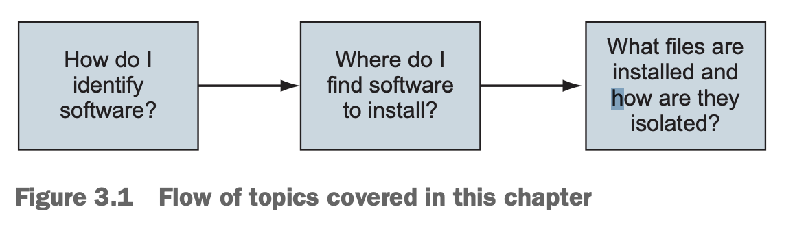

# Chapter 3: Software installation simplified
```md
## This chapter covers
- Nhận dạng software
- Tìm kiếm và cài đặt software với Docker Hub
- Installing software từ các nguồn thay thế
- Hiểu về sự cô lập hệ thống filesystem
- Làm việc với image và layers
```

- Chapter 1 & 2 giới thiệu những khái niệm và sự trừu tượng mới do Docker cung cấp. Chương này đi sâu hơn vào container filesystem và software installation. Nó chia qua trình software installation thành 3 bước, như hình 3.1

- Bước đầu tiên trong việc installing any software nào là xác định software bạn muốn install. Bạn biết rằng phần mềm được phân phối bằng image, nhưng bạn cần biết cách cho Docker biết chính xác image nào bạn muốn install. Chúng ta đã đề cập rằng repositories hold images, nhưng chương này sẽ chỉ ra cách repository lưu trữ và tags được sử dụng để xác định image nhằm install software mà bạn mong muốn
- Chương này trình bày 3 cách chính để install Docker images
  - Sử dụng Docker registries (Sổ đăng ký)
  - Sử dụng các files image với `docker save` và `docker load`
  - Xây dựng image với Dockerfiles
- Trong quá trình đọc tài liệu này, bạn sẽ tìm hiểu cách Docker cô lập software đã install và bạn sẽ được tiếp xúc với 1 thuật ngữ mới, `layer`. Layers, một khái niệm quan trọng khi xử lý image, cung cấp nhiều important features. Chapter này kết thúc với phần nói về cách image hoạt động. Kiến thức đó sẽ giúp bạn đánh giá chất lượng image và thiết lập skillset cơ bản cho phần 2 của cuốn sách này
