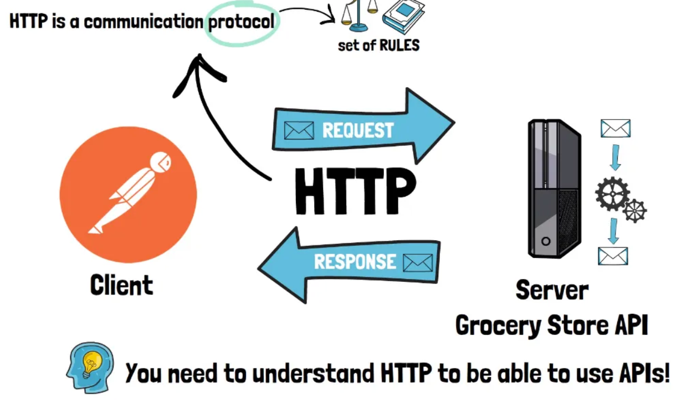
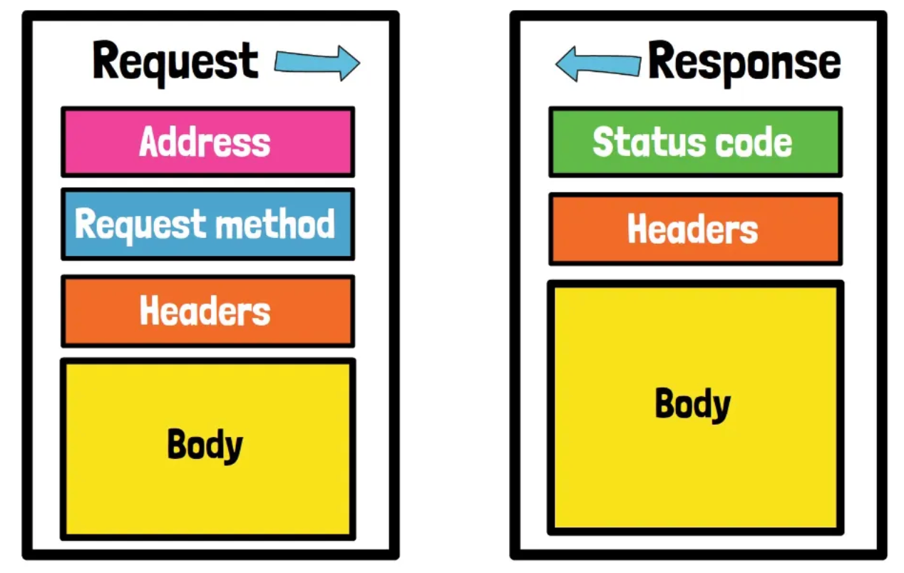
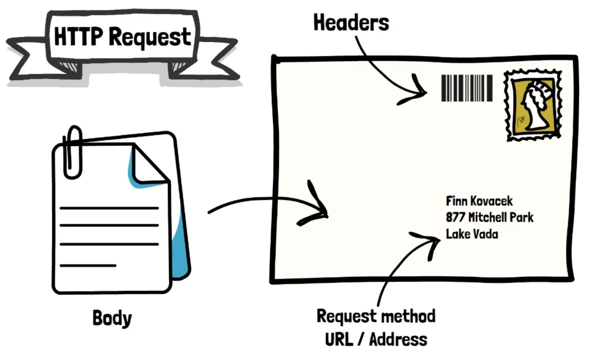
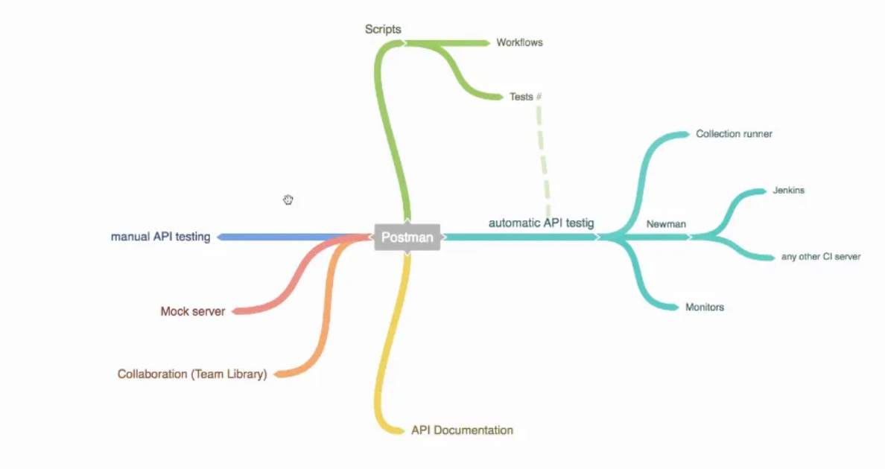

# Introduction and first steps in Postman
## Course overview

- Hiểu API là gì. Làm việc với API đơn giản từ đầu - Điều này sẽ giúp khám phá postman và hiểu cách sử dụng HTTP
- HTTP là giao thức có thể giao tiếp với hầu hết các API và chúng ta cần hiểu rõ về nó - về các method get post put delete
- Giới thiệu định dạng JSON - định dạng phổ biến nhất để đại diện cho dữ liệu
- Chúng ta sẽ sử dụng nhiều API khác nhau vì mỗi API sẽ có cái khác biệt, vì vậy gặp càng nhiều API thì kỹ năng sẽ càng được nâng cao

## How to install Postman

- Có 2 version trên web và download app về (Trước đây có cả extenstion của chrome nhưng không còn được hoạt động nên không nên sử dụng)

## A quick introduction to APIs

- API viết tắt của Application Programming Interface - `Interface` là từ quan trọng nhất cần hiểu. Hãy liên tưởng đến việc sạc điện thoại, mỗi điện thoại có một dây sạc riêng. Tuy nhiên bây giờ hầu hết các điện thoại đều sử dụng 1 tiêu chuẩn là Type-C. Với một bộ sạc, bạn có thể sạc nhiều thiết bị khác nhau như laptop, ipad, iphone,…
- Vì vậy interface về cơ bản là một hợp đồng (contracts) đó là tập hợp các bên khác nhau lại với nhau, thiết lập một bộ quy tắc và để mọi người làm việc riêng của họ miễn là quy tắc đó được giữ nguyên điều này đảm bảo khả năng tương tác
- Đối với sạc Type-C, thông số kỹ thuật làm rõ kích thước và hình dạng của đầu sạc. Nếu không có interface này, bạn không thể sạc điện thoại của mình
- API là một interface cho một số dữ liệu trên máy chủ thường được lưu trữ trong cơ sở dữ liệu. Interface này cho phép một chương trình giao tiếp và trao đổi dữ liệu với server đó. Nếu không có interface này, server sẽ không thể nào truy cập được với thế giới bên ngoài
- Khi nói về API, chúng ta thường đề cập đến các Web API hoạt động qua internet. Ví dụ như weather app, có thể chỉ có 2 hoặc 3 API cung cấp weather data nhưng hàng nghìn weather app sử dụng các API đó
- Hãy nhớ rằng: **API là một interface cho một số data được lưu trữ ở đâu đó từ xa trên một server khác**
- Bởi vì API được thiết kế để sử dụng các chương trình mà chúng không có giao diện như một ứng dụng trên web hay trên app. Nó chỉ có thể được sử dụng nếu bạn sử dụng code hoặc sử dụng endpoint  để viết một số lệnh phức tạp
- Đây là lúc sử dụng postman. Postman có thể kết nối với server thông qua API và trao đổi dữ liệu.

## QUIZ: Introduction to Postman & APIs

1. What does the acronym API stand for in an IT context?
    1. Automatic Processing Interface
    2. Application Postma Interface
    3. Automated Programming Interface
    4. Advanced Processing Interface
    5. Application Programming Interface     x
2. What would be an equivalent term for "Interface" in Application Programming Interface?
    1. Contract or agreement.    x
    2. Partition or Separator
    3. Mixer
        
        An interface can be thought of as a contract because it defines a set of rules that must be followed in order for two entities to communicate or interact with each other. An API defines a set of rules and protocols for how one system can access and make use of the functionality and data provided by another system
        
3. What is a web API?
    1. A tool used to build web applications
    2. An API that uses the internet for communication.      x
    3. A program that runs on the client's computer
    4. A graphical user interface for a web application
    5. All of the above.  
        
        A web API is a set of rules and protocols that define how two systems can communicate with each other over the internet. It allows one system (such as a server) to expose certain functionality or data to other systems (such as mobile application). Web APIs are typically accessed over HTTP or HTTPS, and they can use a variety of data formats (such as JSON or XML) to exchange information. They are often used to enable integrations between different systems, or to allow developers to build applications that interact with a web-based service or platform.

## Your first Postman request

- Link document: https://github.com/vdespa/Postman-Complete-Guide-API-Testing/blob/main/simple-grocery-store-api.md
- `endpoint` là các địa chỉ khác nhau trong API nơi chúng ta có thể tìm thấy thông tin

## A brief oveview of HTTP

- HTTP là một giao thức cho phép khách hàng, trong trường hợp này là người đưa thư
- Và server chạy API để giao tiếp một giao thức về cơ bản là một tập hợp các quy tắc mà cả 2 bên cần tuân theo. Hầu hết các API sử đụng HTTP và điều cần thiết là phải hiểu một số điều cơ bản về HTTP để có thể đọc bất kỳ tài liệu API nào và sử dụng các API

- Sử dụng https đảm bảo rằng mọi dữ liệu của chúng ta gửi đều được mã hoá và không ai có thể đọc bất kỳ tin nhắn nào chúng ta gửi hoặc truy xuất

- Hãy liên tưởng đến việc gửi thư. Về cơ bản khi chúng ta gửi một lá thư, phong bì là yêu cầu và có các thành phần khác nhau: request method và URL là địa chỉ mà bức thư sẽ đến. Headers là một số thông tin bổ sung được thêm vào phong bì, như tem bưu chính hoặc mã vạch - điều này bổ sung một số dữ liệu bổ sung giúp bưu diện chuyển thư của bạn nhanh hơn nhiều. Và cuối cùng - body, là nội dung của chính bức thư, cũng giống như với bức thư có HTTP, bạn cần tuân theo một số quy ước. Bạn cần tạo thông báo HTTP theo cách mà API có thể hiểu chúng
- Và cũng giống như với một bức thư, nếu bạn không đưa vào một số thông tin bắt buộc, thông điệp của bạn có thể không được gửi đi hoặc người nhận có thể không biết bạn muốn gì

## The Postman Landscape

## QUIZ 2: First steps in Postman

- Bạn muốn kiểm tra một API. Tại sao bạn nên đọc tài liệu API?
    - Để hiểu cách sử dụng API.
    - Để khắc phục sự cố với API.
    - Để tìm hiểu về các tính năng và khả năng khác nhau của API.
    - Tất cả các mục trên.    x
- Việc thêm dấu cách vào cuối địa chỉ trong Postman không ảnh hưởng đến điểm cuối nào đang được yêu cầu.
    - True
    - False.   x
- Bạn đã gửi yêu cầu HTTP với Postman. Làm thế nào bạn có thể biết liệu một yêu cầu đã thành công hay chưa?
    - Mã trạng thái yêu cầu là 200 OK.
    - Mã trạng thái phản hồi là 404 Not Found
    - Postman không hiển thị bất kỳ lỗi nào.
    - Mã trạng thái phản hồi là 200 OK.      x
- Cách an toàn nhất để đảm bảo bạn không mắc bất kỳ lỗi chính tả nào khi sử dụng API trong Postman là gì?
    - Sử dụng Postman trên web với trình kiểm tra chính tả trong trình duyệt của bạn.
    - Sao chép và dán điểm cuối API và các tham số từ tài liệu API.
    - Sử dụng tính năng tự động hoàn thành trong Postman.
    - Nhập thủ công điểm cuối và tham số API.
    - Sử dụng tính năng "test" trong Postman để kiểm tra lỗi chính tả
- Theo góc nhìn về cách chúng ta tương tác với API trong Postman, không có sự khác biệt nào giữa HTTP và HTTPS ngoài việc chỉ định giao thức trong URL.
    - True.  x
    - False
        - Từ góc độ cách chúng ta tương tác với API trong Postman, không có sự khác biệt giữa HTTP và HTTPS. HTTP và HTTPS (HTTP Secure) đều là các giao thức truyền dữ liệu qua internet. Sự khác biệt chính giữa hai loại này là HTTPS sử dụng kết nối được mã hóa để bảo mật việc truyền dữ liệu, trong khi HTTP thì không. Khi bạn đưa ra yêu cầu đối với API trong Postman, URL sẽ chỉ định giao thức sẽ sử dụng (chẳng hạn như HTTP hoặc HTTPS). Bất kể bạn sử dụng HTTP hay HTTPS trong URL, cách bạn sử dụng Postman để thực hiện yêu cầu và kiểm tra phản hồi về cơ bản sẽ giống nhau.
- HTTP Request thường bao gồm URL, method, title và body. Postman có thể kiểm soát những phần nào trong số này?
    - URL, method và body
    - URL và body
    - tất cả    x
    - không có phần nào